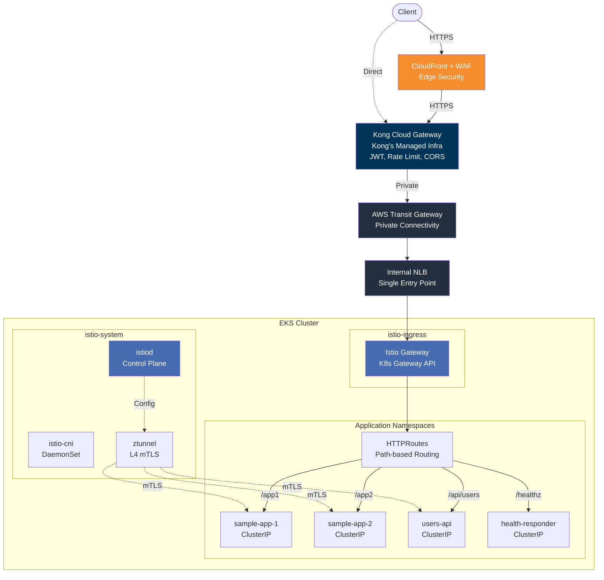
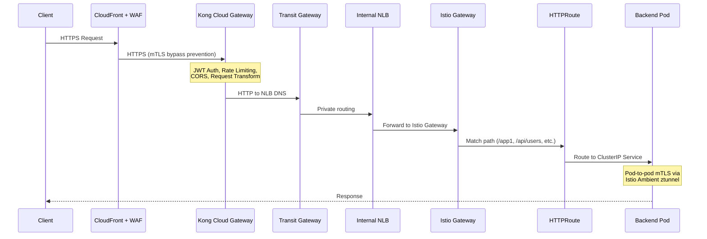
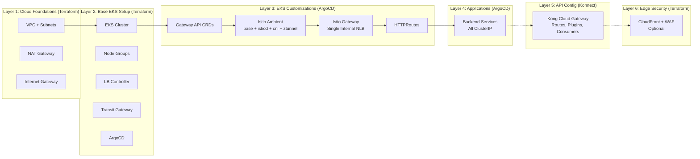

# Kong Dedicated Cloud Gateway on EKS with Istio Gateway API (Ambient Mesh)

This POC demonstrates **Kong Konnect Dedicated Cloud Gateways** with backend services on **AWS EKS**, using **Istio Gateway API (Ambient mode)** as the in-cluster ingress layer and optional **CloudFront + WAF** for edge security.

Kong's data plane runs in Kong's fully managed infrastructure. Backend services in EKS are exposed through a **single Istio Gateway internal NLB**, replacing per-service NLBs. Istio Ambient mesh provides automatic **L4 mTLS** between all pods without sidecar injection.

## Architecture Overview



## Traffic Flow



## Architecture Layers



## Key Design Decisions

| Aspect | Previous (Per-Service NLBs) | Current (Istio Gateway) |
|--------|---------------------------|------------------------|
| **Entry to EKS** | Multiple internal NLBs (1 per service) | Single internal NLB via Istio Gateway |
| **Service type** | `LoadBalancer` per service | `ClusterIP` per service |
| **L7 routing in cluster** | None (Kong did all routing) | Istio Gateway HTTPRoutes |
| **In-cluster mTLS** | None | Automatic via Istio Ambient ztunnel |
| **Kong upstream config** | Different NLB DNS per service | Single NLB DNS for all services |
| **Cost** | ~$16/mo per NLB x N services | Single NLB + Istio control plane |
| **Kong Cloud Gateway** | External (unchanged) | External (unchanged) |
| **Sidecar injection** | N/A | None needed (Ambient mode) |

## What Kong Cloud Gateway Still Handles

Kong Cloud Gateway remains **external** and fully managed by Konnect. It continues to handle:

- **L7 API Management**: JWT authentication, rate limiting, CORS, request transformation
- **Route-level plugins**: Per-service policies applied at the gateway
- **Consumer management**: API keys, JWT credentials
- **CloudFront bypass prevention**: mTLS + custom header validation
- **Public endpoint**: Kong's NLB serves as the internet-facing entry point

The Istio Gateway inside EKS only handles **internal path-based routing** to ClusterIP services.

## Prerequisites

- AWS CLI configured with appropriate credentials
- Terraform >= 1.5
- kubectl
- Helm 3
- [decK CLI](https://docs.konghq.com/deck/latest/) for Kong configuration
- A [Kong Konnect](https://konghq.com/products/kong-konnect) account with Dedicated Cloud Gateway entitlement

## Deployment

### Step 1: Deploy Infrastructure (Terraform)

```bash
cd terraform
terraform init
terraform apply
```

This creates: VPC, EKS cluster, node groups, AWS LB Controller, Transit Gateway, RAM share, ArgoCD.

### Step 2: Configure kubectl

```bash
aws eks update-kubeconfig --name $(terraform -chdir=terraform output -raw cluster_name) --region ap-southeast-2
```

### Step 3: Deploy ArgoCD Root App

```bash
kubectl apply -f argocd/apps/root-app.yaml
```

ArgoCD will automatically deploy in order (via sync waves):
1. **Wave -2**: Gateway API CRDs
2. **Wave -1**: Istio Base CRDs
3. **Wave 0**: istiod + istio-cni + ztunnel (Ambient mesh)
4. **Wave 1**: Namespaces with ambient labels
5. **Wave 5**: Istio Gateway (creates single internal NLB)
6. **Wave 6**: HTTPRoutes (path-based routing)
7. **Wave 7**: Backend applications (all ClusterIP)

### Step 4: (Optional) Generate TLS Certificates

```bash
./scripts/01-generate-certs.sh
kubectl create namespace istio-ingress
kubectl create secret tls istio-gateway-tls \
  --cert=certs/server.crt \
  --key=certs/server.key \
  -n istio-ingress
```

### Step 5: Set Up Kong Cloud Gateway

```bash
export KONNECT_REGION="au"
export KONNECT_TOKEN="kpat_xxx..."
export TRANSIT_GATEWAY_ID=$(terraform -chdir=terraform output -raw transit_gateway_id)
export RAM_SHARE_ARN=$(terraform -chdir=terraform output -raw ram_share_arn)
export EKS_VPC_CIDR=$(terraform -chdir=terraform output -raw vpc_cidr)
./scripts/02-setup-cloud-gateway.sh
```

### Step 6: Get Istio Gateway NLB Endpoint

```bash
./scripts/03-post-terraform-setup.sh
```

Update `deck/kong.yaml` with the single NLB DNS:

```yaml
services:
  - name: users-api
    url: http://<istio-gateway-nlb-dns>:80
  - name: tenant-app1
    url: http://<istio-gateway-nlb-dns>:80
  # ... all services use the SAME NLB
```

Then sync to Konnect:

```bash
deck gateway sync -s deck/kong.yaml \
  --konnect-addr https://au.api.konghq.com \
  --konnect-token $KONNECT_TOKEN \
  --konnect-control-plane-name kong-cloud-gateway-eks
```

## Verification

```bash
# Check Istio components
kubectl get pods -n istio-system

# Check Gateway status
kubectl get gateway -n istio-ingress

# Check HTTPRoutes
kubectl get httproute -A

# Check backend pods
kubectl get pods -n sample-apps
kubectl get pods -n api-services
kubectl get pods -n gateway-health

# Check NLB endpoint
kubectl get gateway -n istio-ingress kong-cloud-gw-gateway \
  -o jsonpath='{.status.addresses[0].value}'

# Test via Kong Cloud Gateway
export KONG_URL="https://<kong-cloud-gw-proxy-url>"
curl $KONG_URL/healthz
curl $KONG_URL/app1
curl $KONG_URL/app2
curl -H "Authorization: Bearer $(./scripts/02-generate-jwt.sh | tail -1)" $KONG_URL/api/users
```

## ArgoCD UI Access

```bash
# Get admin password
terraform -chdir=terraform output -raw argocd_admin_password

# Port-forward
kubectl port-forward svc/argocd-server -n argocd 8080:443

# Open https://localhost:8080 (user: admin)
```

## Directory Structure

```
.
├── argocd/
│   └── apps/
│       ├── root-app.yaml              # App of Apps root
│       ├── 00-gateway-api-crds.yaml   # Gateway API CRDs (wave -2)
│       ├── 01-namespaces.yaml         # Namespaces with ambient labels (wave 1)
│       ├── 02-istio-base.yaml         # Istio Base CRDs (wave -1)
│       ├── 03-istiod.yaml             # Istio control plane (wave 0)
│       ├── 04-istio-cni.yaml          # Istio CNI for ambient (wave 0)
│       ├── 05-ztunnel.yaml            # ztunnel L4 mTLS proxy (wave 0)
│       ├── 06-gateway.yaml            # Istio Gateway resource (wave 5)
│       ├── 07-httproutes.yaml         # HTTPRoutes (wave 6)
│       └── 08-apps.yaml               # Backend applications (wave 7)
├── certs/                             # TLS certificates (generated)
├── deck/
│   └── kong.yaml                      # Kong declarative config (decK)
├── docs/
│   └── images/                        # Architecture diagrams
├── k8s/
│   ├── namespace.yaml                 # Namespaces with ambient labels
│   ├── apps/
│   │   ├── app1-deployment.yaml       # Sample App 1
│   │   ├── app1-service.yaml          # ClusterIP Service
│   │   ├── app2-deployment.yaml       # Sample App 2
│   │   ├── app2-service.yaml          # ClusterIP Service
│   │   ├── health-responder.yaml      # Health check service
│   │   └── sample-api.yaml            # Users API + HTTPRoute
│   └── istio/
│       ├── gateway.yaml               # Istio Gateway (single internal NLB)
│       ├── httproutes.yaml            # Path-based routing rules
│       └── tls-secret.yaml            # TLS secret template
├── scripts/
│   ├── 01-generate-certs.sh           # Generate TLS certs for Gateway
│   ├── 02-setup-cloud-gateway.sh      # Create Kong Cloud GW in Konnect
│   ├── 02-generate-jwt.sh             # Generate JWT token for testing
│   ├── 03-post-terraform-setup.sh     # Display NLB endpoint
│   └── destroy.sh                     # Automated teardown
└── terraform/
    ├── main.tf                        # Main config (VPC, EKS, TGW, ArgoCD)
    ├── variables.tf                   # Input variables
    ├── providers.tf                   # Provider configuration
    ├── outputs.tf                     # Output values
    └── modules/
        ├── vpc/                       # VPC, subnets, NAT Gateway
        ├── eks/                       # EKS cluster, node groups
        ├── iam/                       # IAM roles (LB Controller IRSA)
        ├── lb-controller/             # AWS LB Controller (for Istio Gateway NLB)
        ├── argocd/                    # ArgoCD installation
        └── cloudfront/                # CloudFront + WAF (optional)
```

## Istio Ambient Mesh

This POC uses **Istio Ambient mode**, which provides service mesh capabilities without sidecar proxies:

| Component | Purpose | Deployment |
|-----------|---------|------------|
| **istiod** | Control plane, config distribution | Deployment in istio-system |
| **istio-cni** | Network rules for traffic interception | DaemonSet on all nodes |
| **ztunnel** | L4 mTLS proxy for pod-to-pod encryption | DaemonSet on all nodes |

Namespaces opt into the mesh via the label `istio.io/dataplane-mode: ambient`. No sidecar injection is needed, and applications require zero code changes.

## Cleanup

```bash
# Automated teardown
./scripts/destroy.sh

# Then delete Kong Cloud Gateway in Konnect UI
# https://cloud.konghq.com -> Gateway Manager -> Delete
```

## Network Architecture

```
Your AWS Account                              Kong's AWS Account
================                              ==================

VPC (10.0.0.0/16)                            DCGW VPC (192.168.0.0/16)
├── Private Subnets                          ├── Kong Data Plane Pods
│   ├── EKS Nodes                            │   (auto-scaled, managed)
│   │   ├── Istio Control Plane              │
│   │   ├── Istio Gateway Pod ──────────┐    ├── Kong Cloud GW NLB (public)
│   │   ├── Backend App Pods             │    │   (internet-facing)
│   │   └── ztunnel (mTLS)               │    │
│   │                                     │    │
│   └── Internal NLB ◄───────────────────┘    │
│       (single entry point)                   │
│                                              │
├── Transit Gateway ◄─────────────────────────►│ Transit Gateway Attachment
│   (shared via RAM)                           │
│                                              │
└── Route: 192.168.0.0/16 → TGW              └── Route: 10.0.0.0/16 → TGW
```

## Security Layers

1. **Edge**: CloudFront + WAF (DDoS, SQLi/XSS, rate limiting) -- optional
2. **Origin mTLS**: CloudFront client certificate to Kong -- optional
3. **Kong Plugins**: JWT auth, rate limiting, CORS, request transformation
4. **Transit Gateway**: Private connectivity (no public exposure of backend)
5. **Istio Ambient mTLS**: Automatic L4 encryption between all mesh pods
6. **ClusterIP Services**: No direct external access to backend services
