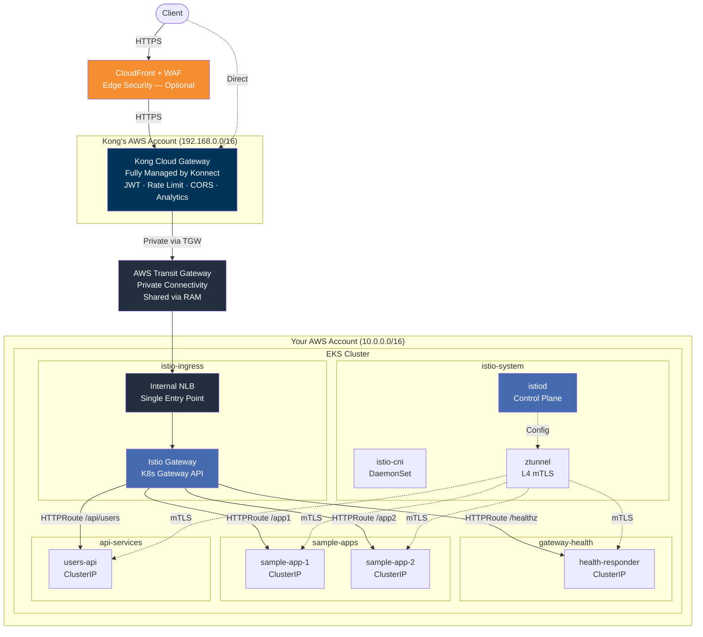
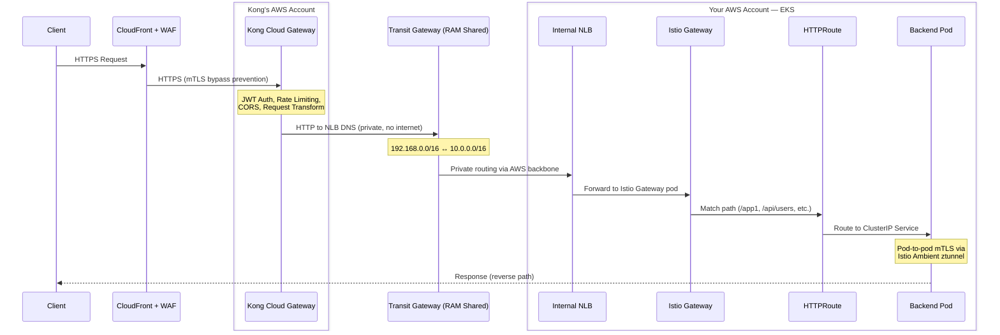
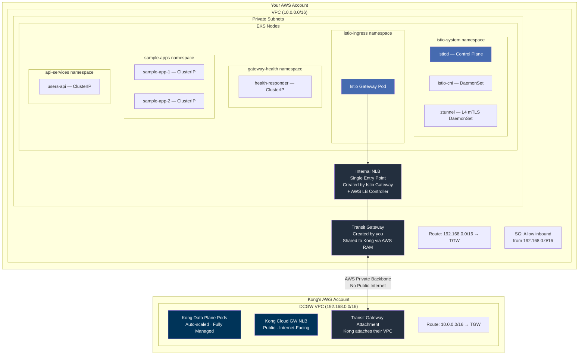
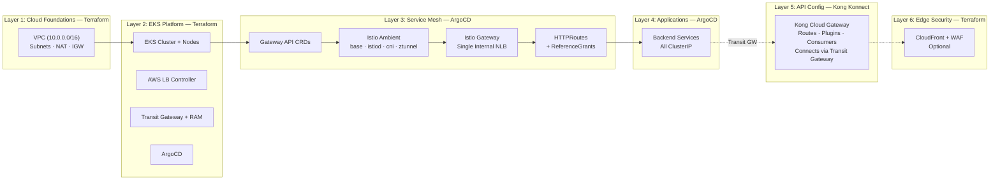

# Kong Dedicated Cloud Gateway on EKS with Istio Gateway API (Ambient Mesh)

Kong Konnect Dedicated Cloud Gateway with backend services on AWS EKS. Kong's API gateway runs **externally in Kong's AWS account** — fully managed, with JWT auth, rate limiting, CORS, and analytics all visible in the [Konnect UI](https://cloud.konghq.com). Backend services in EKS sit behind a **single Istio Gateway internal NLB**, connected to Kong via **AWS Transit Gateway** over private networking. **Istio Ambient mesh** adds automatic L4 mTLS between all pods — no sidecars needed.

---

## Architecture

Two AWS accounts are involved. Traffic never touches the public internet between Kong and EKS.



### Traffic Flow



### Private Connectivity Between Accounts



How it works:

1. **Terraform** creates an AWS Transit Gateway in your account
2. **AWS RAM** shares the Transit Gateway with Kong's AWS account
3. **Kong** attaches their Cloud Gateway VPC to your Transit Gateway
4. Route tables on both sides direct cross-VPC traffic through the Transit Gateway
5. A security group rule allows inbound from Kong's CIDR (`192.168.0.0/16`)

---

## What Each Component Handles

| Responsibility | Kong Cloud Gateway (External) | Istio Gateway (In-Cluster) |
|---------------|-------------------------------|---------------------------|
| **Where** | Kong's AWS account, managed by Konnect | Your EKS cluster |
| **L7 API policies** | JWT auth, rate limiting, CORS, transforms | — |
| **Routing** | Routes to single NLB by path | HTTPRoutes to ClusterIP services |
| **Analytics** | Full dashboard in Konnect UI | — |
| **mTLS** | — | Automatic L4 via Ambient ztunnel |
| **Entry point** | Public NLB (internet-facing) | Internal NLB (Transit GW only) |
| **Configuration** | Konnect UI or decK CLI | ArgoCD (GitOps) |

### Istio Ambient Mesh

Sidecar-less service mesh — automatic L4 mTLS with zero application changes:

| Component | What it does | Runs as |
|-----------|-------------|---------|
| **istiod** | Control plane, distributes config | Deployment in `istio-system` |
| **istio-cni** | Intercepts traffic for mesh routing | DaemonSet on all nodes |
| **ztunnel** | Encrypts pod-to-pod traffic (mTLS) | DaemonSet on all nodes |

Namespaces join the mesh via label: `istio.io/dataplane-mode: ambient`

### Security Layers

| Layer | Component | Protection |
|-------|-----------|------------|
| 1 | CloudFront + WAF | DDoS, SQLi/XSS, rate limiting, geo-blocking (optional) |
| 2 | Origin mTLS | CloudFront bypass prevention (optional) |
| 3 | Kong Plugins | JWT auth, rate limiting, CORS, request transform |
| 4 | Transit Gateway | Private connectivity — backends never exposed publicly |
| 5 | Istio Ambient mTLS | Automatic L4 encryption between all mesh pods |
| 6 | ClusterIP Services | No direct external access to backend services |

---

## Deployment

### Prerequisites

- AWS CLI configured with credentials
- Terraform >= 1.5
- kubectl + Helm 3
- [decK CLI](https://docs.konghq.com/deck/latest/)
- [Kong Konnect](https://konghq.com/products/kong-konnect) account with Dedicated Cloud Gateway entitlement

### Step 1: Configure Konnect Credentials

```bash
cp .env.example .env
```

Edit `.env` — only **3 values** needed:

```bash
KONNECT_REGION="au"
KONNECT_TOKEN="kpat_your_token_here"
KONNECT_CONTROL_PLANE_NAME="kong-cloud-gateway-eks"
```

> `.env` is **gitignored** — your token never gets committed. All scripts auto-source it. Transit Gateway IDs and NLB DNS are **auto-read from Terraform** — no manual entry needed.

### Step 2: Deploy Infrastructure

```bash
cd terraform
terraform init
terraform apply
```

This creates: VPC, EKS cluster, node groups, AWS LB Controller, Transit Gateway, RAM share, and ArgoCD.

### Step 3: Configure kubectl

```bash
aws eks update-kubeconfig --name $(terraform -chdir=terraform output -raw cluster_name) --region ap-southeast-2
```

### Step 4: Deploy ArgoCD Root App

```bash
kubectl apply -f argocd/apps/root-app.yaml
```

ArgoCD deploys everything via **sync waves** in dependency order:

| Wave | Component | What it deploys |
|------|-----------|----------------|
| -2 | Gateway API CRDs | `Gateway`, `HTTPRoute`, `ReferenceGrant` CRDs |
| -1 | Istio Base | Istio CRDs and cluster-wide resources |
| 0 | istiod + cni + ztunnel | Ambient mesh control and data plane |
| 1 | Namespaces | Namespaces with `istio.io/dataplane-mode: ambient` label |
| 5 | Istio Gateway | Single internal NLB via AWS LB Controller |
| 6 | HTTPRoutes | Path-based routing + ReferenceGrants |
| 7 | Applications | Backend services (all ClusterIP) |

### Step 5: Set Up Kong Cloud Gateway

```bash
./scripts/02-setup-cloud-gateway.sh
```

Then accept the Transit Gateway attachment in AWS Console:
**VPC → Transit Gateway Attachments → Accept**

### Step 6: Configure Kong Routes

Get the Istio Gateway NLB endpoint:

```bash
./scripts/03-post-terraform-setup.sh
```

Update `deck/kong.yaml` — all services point to the **same** NLB:

```yaml
services:
  - name: users-api
    url: http://<istio-gateway-nlb-dns>:80
  - name: tenant-app1
    url: http://<istio-gateway-nlb-dns>:80
  - name: tenant-app2
    url: http://<istio-gateway-nlb-dns>:80
  - name: gateway-health
    url: http://<istio-gateway-nlb-dns>:80
```

Sync to Konnect:

```bash
deck gateway sync -s deck/kong.yaml \
  --konnect-addr https://${KONNECT_REGION}.api.konghq.com \
  --konnect-token $KONNECT_TOKEN \
  --konnect-control-plane-name $KONNECT_CONTROL_PLANE_NAME
```

### Step 7 (Optional): TLS Certificates

For end-to-end TLS (Kong → NLB → Istio Gateway over HTTPS):

```bash
./scripts/01-generate-certs.sh
kubectl create secret tls istio-gateway-tls \
  --cert=certs/server.crt \
  --key=certs/server.key \
  -n istio-ingress
```

---

## Konnect UI — Analytics & Configuration

Once deployed, everything is visible and configurable at [cloud.konghq.com](https://cloud.konghq.com):

| Feature | Where in Konnect UI |
|---------|-------------------|
| **API Analytics** | Analytics → Dashboard (request counts, latency P50/P95/P99, error rates) |
| **Gateway Health** | Gateway Manager → Data Plane Nodes (status, connections) |
| **Routes & Services** | Gateway Manager → Routes / Services |
| **Plugins** | Gateway Manager → Plugins (JWT, rate limiting, CORS, transforms) |
| **Consumers** | Gateway Manager → Consumers (API keys, JWT credentials, usage) |
| **Dev Portal** | Dev Portal → Published APIs (optional) |

---

## Verification

```bash
# Istio Ambient components
kubectl get pods -n istio-system

# Gateway status and NLB address
kubectl get gateway -n istio-ingress
kubectl get gateway -n istio-ingress kong-cloud-gw-gateway \
  -o jsonpath='{.status.addresses[0].value}'

# HTTPRoutes
kubectl get httproute -A

# Backend pods
kubectl get pods -n gateway-health
kubectl get pods -n sample-apps
kubectl get pods -n api-services

# End-to-end test via Kong Cloud Gateway
export KONG_URL="https://<kong-cloud-gw-proxy-url>"
curl $KONG_URL/healthz
curl $KONG_URL/app1
curl $KONG_URL/app2
curl -H "Authorization: Bearer $(./scripts/02-generate-jwt.sh | tail -1)" \
  $KONG_URL/api/users
```

### ArgoCD UI

```bash
terraform -chdir=terraform output -raw argocd_admin_password
kubectl port-forward svc/argocd-server -n argocd 8080:443
# Open https://localhost:8080 (user: admin)
```

---

## Teardown

```bash
./scripts/destroy.sh
```

The script tears down in the correct order to avoid orphaned AWS resources:

1. **Delete Istio Gateway** → triggers NLB deprovisioning via AWS LB Controller
2. **Wait for NLB/ENI cleanup** → prevents VPC deletion failures
3. **Delete ArgoCD apps** → cascade removes Istio components and workloads
4. **Cleanup CRDs** → removes Gateway API and Istio CRDs (finalizers)
5. **Terraform destroy** → removes EKS, VPC, Transit Gateway, RAM share

**Kong Cloud Gateway** runs in Kong's AWS account — delete it separately:

```bash
# Konnect UI: https://cloud.konghq.com → Gateway Manager → Delete
# Or via API:
curl -X DELETE "https://${KONNECT_REGION}.api.konghq.com/v2/control-planes/${CP_ID}" \
  -H "Authorization: Bearer $KONNECT_TOKEN"
```

---

## Deployment Layers


