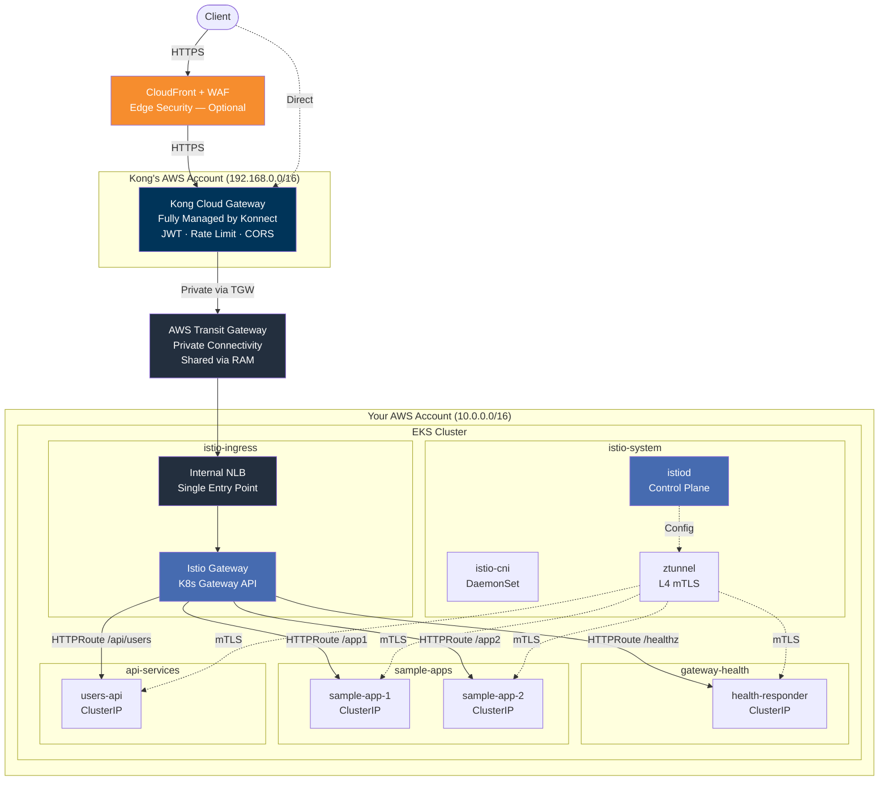
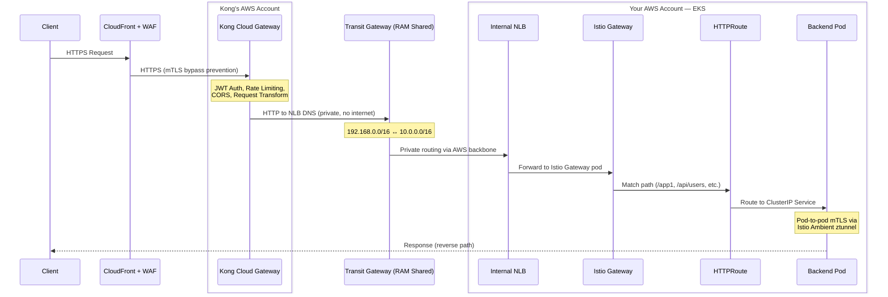
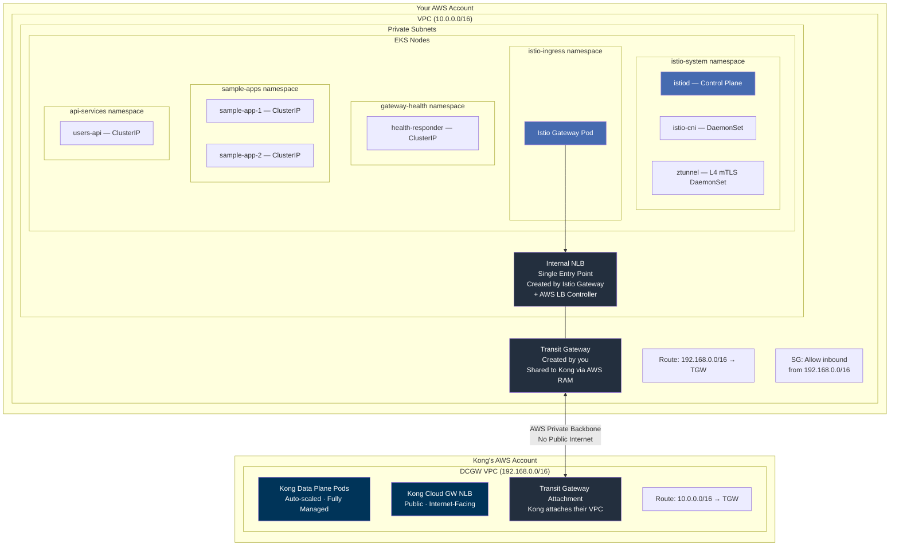
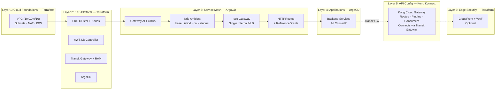

# Kong Dedicated Cloud Gateway on EKS with Istio Gateway API (Ambient Mesh)

This project demonstrates **Kong Konnect Dedicated Cloud Gateways** with backend services on **AWS EKS**, using **Istio Gateway API (Ambient mode)** for in-cluster routing and optional **CloudFront + WAF** for edge security.

**Key characteristics:**

- **Kong Cloud Gateway** runs in **Kong's AWS account** (fully managed by Konnect) -- not in your EKS cluster
- **Istio Gateway** creates a **single internal NLB** in your EKS cluster, replacing per-service NLBs
- **AWS Transit Gateway** provides private connectivity between the two AWS accounts
- **Istio Ambient mesh** provides automatic **L4 mTLS** between all pods without sidecars

---

## Architecture Overview

Two AWS accounts are involved. Kong manages the API gateway in their infrastructure. Your EKS cluster hosts the backend services behind a single Istio Gateway NLB.



---

## Traffic Flow

All traffic between Kong and EKS traverses the AWS Transit Gateway over AWS's private backbone -- it never touches the public internet.



---

## Network Architecture (Two AWS Accounts)



**How private connectivity works:**

1. You create an **AWS Transit Gateway** in your account (Terraform handles this)
2. You share the Transit Gateway with Kong's AWS account via **AWS RAM** (Resource Access Manager)
3. Kong attaches their Cloud Gateway VPC to your Transit Gateway
4. Route tables on both sides direct cross-VPC traffic through the Transit Gateway
5. A security group rule allows inbound traffic from Kong's CIDR (`192.168.0.0/16`)

---

## Deployment Layers

The stack is deployed in six layers. Terraform handles infrastructure (Layers 1, 2, 6). ArgoCD handles Kubernetes resources (Layers 3, 4). Kong Konnect handles API configuration (Layer 5).



---

## Key Design Decisions

| Aspect | Previous (Per-Service NLBs) | Current (Istio Gateway) |
|--------|---------------------------|------------------------|
| **Entry to EKS** | Multiple internal NLBs (1 per service) | Single internal NLB via Istio Gateway |
| **Service type** | `LoadBalancer` per service | `ClusterIP` per service |
| **L7 routing in cluster** | None (Kong did all routing) | Istio Gateway HTTPRoutes (path-based) |
| **In-cluster mTLS** | None | Automatic via Istio Ambient ztunnel |
| **Kong upstream config** | Different NLB DNS per service | Single NLB DNS for all services |
| **Cost** | ~$16/mo per NLB x N services | Single NLB + Istio control plane |
| **Kong Cloud Gateway** | External (unchanged) | External (unchanged) |
| **Sidecar injection** | N/A | None needed (Ambient mode) |

### What Kong Cloud Gateway Handles (External)

Kong Cloud Gateway remains **external** in Kong's AWS account, fully managed by Konnect:

- **L7 API Management**: JWT authentication, rate limiting, CORS, request transformation
- **Route-level plugins**: Per-service policies applied at the gateway
- **Consumer management**: API keys, JWT credentials
- **CloudFront bypass prevention**: mTLS + custom header validation
- **Public endpoint**: Kong's NLB serves as the internet-facing entry point

### What Istio Gateway Handles (In-Cluster)

- **Single NLB entry point**: One internal NLB for all backend services
- **Path-based routing**: HTTPRoutes direct traffic to the correct ClusterIP service
- **Cross-namespace routing**: ReferenceGrants allow routing across namespaces
- **Automatic mTLS**: Ambient mesh encrypts all pod-to-pod traffic via ztunnel

---

## Istio Ambient Mesh

This project uses **Istio Ambient mode**, which provides service mesh capabilities without sidecar proxies:

| Component | Purpose | Deployment |
|-----------|---------|------------|
| **istiod** | Control plane, config distribution | Deployment in `istio-system` |
| **istio-cni** | Network rules for traffic interception | DaemonSet on all nodes |
| **ztunnel** | L4 mTLS proxy for pod-to-pod encryption | DaemonSet on all nodes |

Namespaces opt into the mesh via the label `istio.io/dataplane-mode: ambient`. No sidecar injection is needed. Applications require zero code changes.

---

## Security Layers

| Layer | Component | Protection | Where |
|-------|-----------|------------|-------|
| 1 | **CloudFront + WAF** | DDoS, SQLi/XSS, rate limiting, geo-blocking | AWS Edge (optional) |
| 2 | **Origin mTLS** | CloudFront bypass prevention | CloudFront → Kong (optional) |
| 3 | **Kong Plugins** | JWT auth, rate limiting, CORS, request transform | Kong's AWS Account |
| 4 | **Transit Gateway** | Private connectivity, no public backend exposure | AWS backbone |
| 5 | **Istio Ambient mTLS** | Automatic L4 encryption between all mesh pods | EKS in-cluster |
| 6 | **ClusterIP Services** | No direct external access to backend services | EKS in-cluster |

---

## Prerequisites

- AWS CLI configured with appropriate credentials
- Terraform >= 1.5
- kubectl
- Helm 3
- [decK CLI](https://docs.konghq.com/deck/latest/) for Kong declarative configuration
- A [Kong Konnect](https://konghq.com/products/kong-konnect) account with Dedicated Cloud Gateway entitlement

---

## Deployment

### Step 1: Configure Konnect Credentials

```bash
cp .env.example .env
```

Edit `.env` — you only need to set **3 values** (Konnect credentials):

```bash
KONNECT_REGION="au"
KONNECT_TOKEN="kpat_your_token_here"
KONNECT_CONTROL_PLANE_NAME="kong-cloud-gateway-eks"
```

> **`.env` is gitignored** — your token will never be committed to Git.
> All scripts automatically source `.env` so you don't need to export variables manually.
> Transit Gateway IDs, NLB DNS, and VPC CIDR are **auto-read from Terraform outputs** — no manual entry needed.

### Step 2: Deploy Infrastructure (Terraform)

```bash
cd terraform
terraform init
terraform apply
```

Creates: VPC, EKS cluster, node groups, AWS LB Controller, Transit Gateway, RAM share, ArgoCD.

### Step 3: Configure kubectl

```bash
aws eks update-kubeconfig --name $(terraform -chdir=terraform output -raw cluster_name) --region ap-southeast-2
```

### Step 4: Deploy ArgoCD Root App

```bash
kubectl apply -f argocd/apps/root-app.yaml
```

ArgoCD deploys everything automatically via **sync waves** in the correct dependency order:

| Wave | Component | What it deploys |
|------|-----------|----------------|
| -2 | Gateway API CRDs | `Gateway`, `HTTPRoute`, `ReferenceGrant` CRDs |
| -1 | Istio Base | Istio CRDs and cluster-wide resources |
| 0 | istiod + cni + ztunnel | Ambient mesh control plane and data plane |
| 1 | Namespaces | Namespaces with `istio.io/dataplane-mode: ambient` label |
| 5 | Istio Gateway | Single internal NLB (via AWS LB Controller) |
| 6 | HTTPRoutes | Path-based routing rules + ReferenceGrants |
| 7 | Applications | Backend services (all ClusterIP) |

### Step 5: (Optional) Generate TLS Certificates

```bash
./scripts/01-generate-certs.sh
kubectl create secret tls istio-gateway-tls \
  --cert=certs/server.crt \
  --key=certs/server.key \
  -n istio-ingress
```

### Step 6: Set Up Kong Cloud Gateway in Konnect

```bash
# .env is auto-sourced — no need to export KONNECT_TOKEN manually
./scripts/02-setup-cloud-gateway.sh
```

After running, accept the Transit Gateway attachment in AWS Console:
**VPC → Transit Gateway Attachments → Accept**

### Step 7: Configure Kong Routes (decK)

Get the Istio Gateway NLB endpoint:

```bash
./scripts/03-post-terraform-setup.sh
```

Update `deck/kong.yaml` — all services point to the **same** single NLB:

```yaml
services:
  - name: users-api
    url: http://<istio-gateway-nlb-dns>:80    # Same NLB for all
  - name: tenant-app1
    url: http://<istio-gateway-nlb-dns>:80    # Istio HTTPRoutes handle
  - name: tenant-app2
    url: http://<istio-gateway-nlb-dns>:80    # path-based routing
  - name: gateway-health
    url: http://<istio-gateway-nlb-dns>:80    # inside the cluster
```

Sync to Konnect (`.env` is auto-sourced):

```bash
deck gateway sync -s deck/kong.yaml \
  --konnect-addr https://${KONNECT_REGION}.api.konghq.com \
  --konnect-token $KONNECT_TOKEN \
  --konnect-control-plane-name $KONNECT_CONTROL_PLANE_NAME
```

### Konnect UI — Analytics & Configuration

Once deployed, everything is visible and configurable in the **Konnect UI** at [cloud.konghq.com](https://cloud.konghq.com):

| Feature | Where in Konnect UI |
|---------|-------------------|
| **API Analytics** | Analytics → Dashboard (request counts, latency P50/P95/P99, error rates) |
| **Gateway Health** | Gateway Manager → Data Plane Nodes (status, connections) |
| **Routes & Services** | Gateway Manager → Routes / Services |
| **Plugins** | Gateway Manager → Plugins (JWT, rate limiting, CORS, transforms) |
| **Consumers** | Gateway Manager → Consumers (API keys, JWT credentials, usage) |
| **Dev Portal** | Dev Portal → Published APIs (optional, for API documentation) |

---

## Verification

```bash
# 1. Check Istio Ambient components are running
kubectl get pods -n istio-system

# 2. Check Gateway is programmed and has an NLB address
kubectl get gateway -n istio-ingress
kubectl get gateway -n istio-ingress kong-cloud-gw-gateway \
  -o jsonpath='{.status.addresses[0].value}'

# 3. Check HTTPRoutes are attached to the Gateway
kubectl get httproute -A

# 4. Check backend pods are running
kubectl get pods -n gateway-health
kubectl get pods -n sample-apps
kubectl get pods -n api-services

# 5. Test end-to-end via Kong Cloud Gateway
export KONG_URL="https://<kong-cloud-gw-proxy-url>"
curl $KONG_URL/healthz
curl $KONG_URL/app1
curl $KONG_URL/app2
curl -H "Authorization: Bearer $(./scripts/02-generate-jwt.sh | tail -1)" \
  $KONG_URL/api/users
```

---

## ArgoCD UI Access

```bash
# Get admin password
terraform -chdir=terraform output -raw argocd_admin_password

# Port-forward
kubectl port-forward svc/argocd-server -n argocd 8080:443

# Open https://localhost:8080 (user: admin)
```

---

## Cleanup / Teardown

The destroy script handles teardown in the correct order to avoid orphaned AWS resources:

```bash
./scripts/destroy.sh
```

**Teardown order:**

1. Delete Istio Gateway resource (triggers NLB deprovisioning via AWS LB Controller)
2. Wait for internal NLB and ENIs to be fully removed
3. Delete ArgoCD applications (cascade deletes Istio components and apps)
4. Cleanup Istio CRDs, Gateway API CRDs, and namespaces
5. Run `terraform destroy` (removes EKS, VPC, Transit Gateway, RAM share)

**Important:** Kong Cloud Gateway runs in Kong's AWS account and must be deleted separately:

```bash
# Option A: Konnect UI
# https://cloud.konghq.com -> Gateway Manager -> Delete

# Option B: Konnect API
curl -X DELETE "https://${KONNECT_REGION}.api.konghq.com/v2/control-planes/${CP_ID}" \
  -H "Authorization: Bearer $KONNECT_TOKEN"
```

