# Kong Dedicated Cloud Gateway on EKS — MunchGo Microservices Platform

Kong Konnect Dedicated Cloud Gateway with **MunchGo microservices** on AWS EKS. Kong's API gateway runs **externally in Kong's AWS account** — fully managed, with JWT RS256 auth, rate limiting, CORS, and analytics via the [Konnect UI](https://cloud.konghq.com). Backend services in EKS sit behind a **single Istio Gateway internal NLB**, connected to Kong via **AWS Transit Gateway** over private networking. **Istio Ambient mesh** adds automatic L4 mTLS between all pods — no sidecars needed. L7 observability via **waypoint proxies**.

**CloudFront + WAF** is mandatory — Kong Cloud Gateway has a public-facing NLB that must be protected. All client traffic passes through CloudFront for WAF inspection (DDoS, SQLi/XSS, rate limiting, geo-blocking) before reaching Kong. Origin mTLS prevents direct access to Kong Cloud Gateway, ensuring nobody can bypass WAF.

The entire stack deploys with **zero manual steps** — Terraform provisions infrastructure, ArgoCD syncs K8s resources via GitOps, and scripts handle Konnect API setup including RAM sharing and TGW attachment.

---

## Table of Contents

- [Architecture](#architecture)
  - [Istio Ambient Service Mesh](#istio-ambient-service-mesh)
  - [East-West Traffic](#east-west-traffic--how-services-communicate)
- [MunchGo Microservices](#munchgo-microservices)
  - [Authentication & JWT Flow](#authentication--jwt-flow)
  - [Order Saga Flow](#order-saga-flow)
- [Repository Structure](#repository-structure)
- [GitOps Pipeline](#gitops-pipeline)
- [Prerequisites](#prerequisites)
- [Deployment](#deployment)
- [Verification](#verification)
- [Observability](#observability)
- [Konnect UI](#konnect-ui)
- [Teardown](#teardown)
- [Appendix](#appendix)

---

## Architecture

### High-Level Overview

Two AWS accounts are involved. Traffic never touches the public internet between Kong and EKS. MunchGo microservices communicate east-west via Istio Ambient mTLS and north-south through Kong Cloud Gateway.

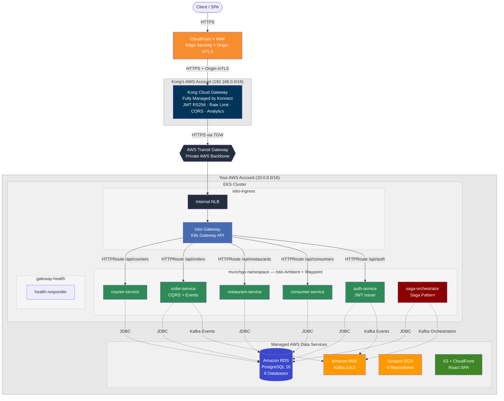

### End-to-End Encryption

TLS terminates and re-encrypts at each trust boundary. Traffic is encrypted at every hop.

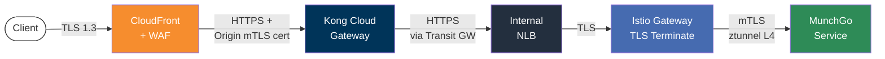

| Hop | Protocol | Encryption | Terminates At |
|-----|----------|-----------|---------------|
| Client → CloudFront | HTTPS | TLS 1.2/1.3 (AWS-managed cert) | CloudFront edge |
| CloudFront → Kong | HTTPS | TLS + Origin mTLS client certificate | Kong Cloud Gateway |
| Kong → NLB (via TGW) | HTTPS | TLS (private AWS backbone via Transit GW) | Istio Gateway |
| NLB → Istio Gateway | TLS | TLS passthrough (NLB L4) | Istio Gateway (port 443) |
| Istio Gateway → Pod | HTTP | Istio Ambient mTLS (ztunnel L4) | Backend pod |

### Traffic Flow

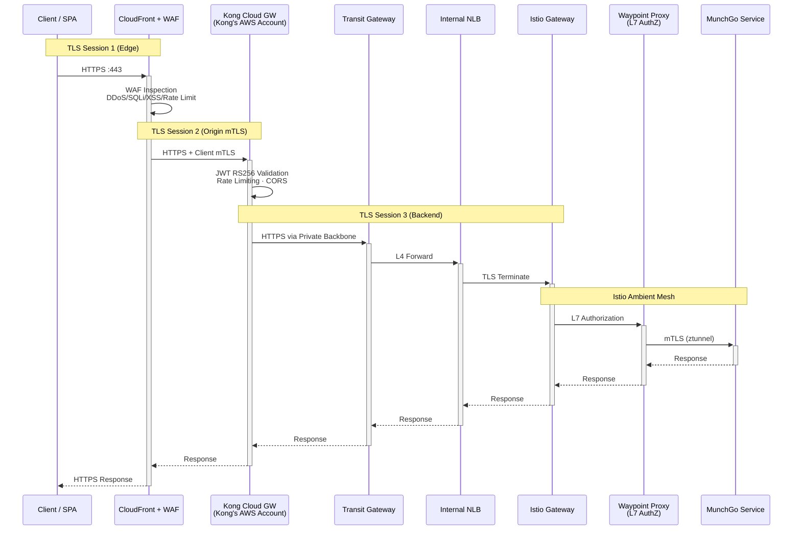

### Istio Ambient Service Mesh

MunchGo uses **Istio Ambient Mesh** — zero sidecar containers. L4 mTLS is handled by **ztunnel** (DaemonSet on every node). L7 policies are enforced by a **waypoint proxy** per namespace.

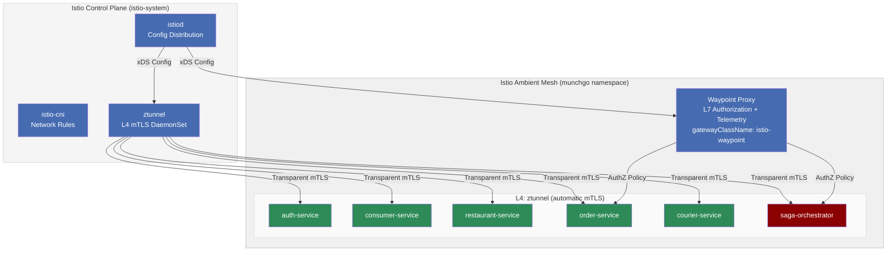

| Component | Role | Scope |
|-----------|------|-------|
| **ztunnel** | L4 mTLS proxy (DaemonSet) | Automatic — encrypts all pod-to-pod traffic |
| **Waypoint** | L7 proxy (per namespace) | AuthorizationPolicy, telemetry, traffic management |
| **PeerAuthentication** | mTLS mode | `STRICT` — all traffic must be mTLS |
| **AuthorizationPolicy** | Access control | Restricts saga-orchestrator, allows gateway ingress |
| **Telemetry** | Observability | Jaeger tracing (100%), Prometheus metrics, access logs |

### East-West Traffic — How Services Communicate

MunchGo uses a **hybrid communication model**: synchronous HTTP calls for saga orchestration (protected by Istio mTLS) and asynchronous Kafka events for domain events (via external MSK).

**Only the Saga Orchestrator makes direct HTTP calls to other services.** All other services communicate exclusively via Kafka. Istio authorization policies enforce this — even though all services have ClusterIP endpoints, only authorized sources can reach them.

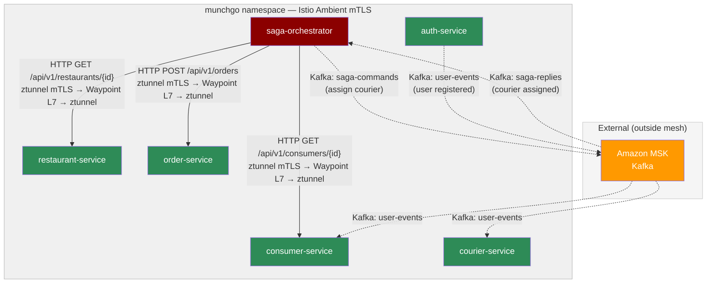

**Solid arrows** = synchronous HTTP (encrypted by Istio ztunnel mTLS, authorized by waypoint L7 policy).
**Dashed arrows** = asynchronous Kafka (external to mesh, via Amazon MSK).

#### Service Communication Matrix

| Source | Target | Protocol | Path / Topic | Istio mTLS? |
|--------|--------|----------|-------------|-------------|
| **Saga Orchestrator** | Consumer Service | HTTP GET | `/api/v1/consumers/{id}` | Yes (ztunnel + waypoint) |
| **Saga Orchestrator** | Restaurant Service | HTTP GET | `/api/v1/restaurants/{id}` | Yes (ztunnel + waypoint) |
| **Saga Orchestrator** | Order Service | HTTP POST/PUT | `/api/v1/orders`, `/api/v1/orders/{id}/approve` | Yes (ztunnel + waypoint) |
| **Saga Orchestrator** | Courier Service | Kafka | `saga-commands` topic | No (external MSK) |
| Courier Service | Saga Orchestrator | Kafka | `saga-replies` topic | No (external MSK) |
| Auth Service | Consumer Service | Kafka | `user-events` topic | No (external MSK) |
| Auth Service | Courier Service | Kafka | `user-events` topic | No (external MSK) |
| Istio Gateway | All services | HTTP | HTTPRoute path-based routing | Yes (ztunnel) |

#### How ztunnel and Waypoint Handle East-West Traffic

When the Saga Orchestrator calls the Consumer Service via HTTP:

```
Saga Pod → ztunnel (mTLS encrypt) → Waypoint (L7 AuthZ check) → ztunnel (mTLS decrypt) → Consumer Pod
```

1. **ztunnel** on the source node intercepts outbound traffic and encrypts it with mTLS (SPIFFE identity)
2. **Waypoint proxy** receives the encrypted traffic, terminates mTLS, and enforces L7 authorization policies (checking that the source service account is `munchgo-order-saga-orchestrator`)
3. **ztunnel** on the destination node re-encrypts and delivers to the Consumer pod
4. The **waypoint** also emits L7 telemetry: Jaeger traces, Prometheus request metrics, and access logs

Kafka traffic bypasses Istio entirely because MSK runs outside the cluster in dedicated AWS-managed infrastructure.

#### Istio Authorization Policies (Least Privilege)

Four policies enforce the communication matrix:

| Policy | What It Does |
|--------|-------------|
| `allow-gateway-ingress` | Istio Gateway (istio-ingress namespace) can reach all 5 API services |
| `allow-saga-orchestrator` | Saga Orchestrator service account can call Consumer, Restaurant, Order, Courier |
| `restrict-saga-orchestrator` | Saga Orchestrator only reachable from within munchgo namespace + Istio Gateway |
| `allow-health-checks` | Any source can reach `/actuator/health/*` endpoints (for K8s probes) |

**Default deny**: any traffic not explicitly allowed is blocked. If Consumer Service tried to call Order Service via HTTP, the waypoint would reject it — only Saga Orchestrator has that permission.

### Private Connectivity

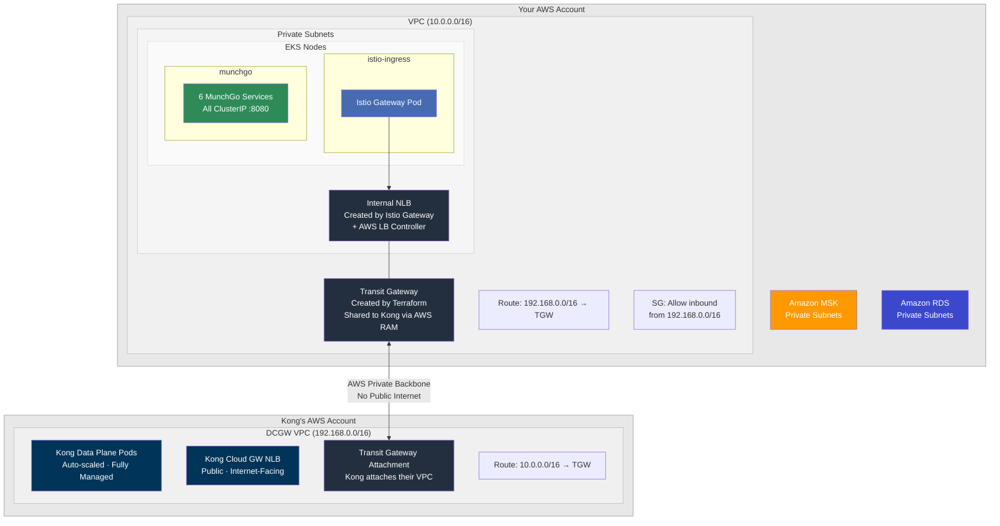

How it works (all automated):

1. **Terraform** creates the Transit Gateway, VPC attachment, route tables, and security group rules
2. **Setup script** fetches Kong's AWS account ID from Konnect, adds it as a RAM principal, and creates the TGW attachment
3. **Transit Gateway** auto-accepts Kong's attachment (`auto_accept_shared_attachments` is enabled)
4. Route tables on both sides direct cross-VPC traffic through the Transit Gateway
5. No manual steps — no AWS Console acceptance needed

### Security Layers

| Layer | Component | Protection |
|-------|-----------|------------|
| 1 | CloudFront + WAF | DDoS, SQLi/XSS, rate limiting, geo-blocking |
| 2 | Origin mTLS | CloudFront bypass prevention (via CloudFormation) |
| 3 | Kong Plugins | JWT RS256 auth, per-route rate limiting, CORS, request transform |
| 4 | Transit Gateway | Private connectivity — backends never exposed publicly |
| 5 | Istio Ambient mTLS | Automatic L4 encryption between all mesh pods (ztunnel) |
| 6 | Waypoint AuthZ | L7 authorization policies for east-west traffic |
| 7 | PeerAuthentication | Strict mTLS enforcement — no plaintext allowed |
| 8 | ClusterIP Services | No direct external access to backend services |
| 9 | External Secrets | AWS Secrets Manager → K8s Secrets via IRSA (no hardcoded credentials) |

---

## MunchGo Microservices

A food delivery platform built with Java 21 + Spring Boot, following event-driven, CQRS, and saga orchestration patterns.

### Service Architecture

The platform uses two distinct communication patterns: **north-south** traffic enters via Kong Cloud Gateway through the Istio Gateway, while **east-west** traffic between services uses a mix of synchronous HTTP (via Istio mTLS) and asynchronous Kafka events (via external MSK).

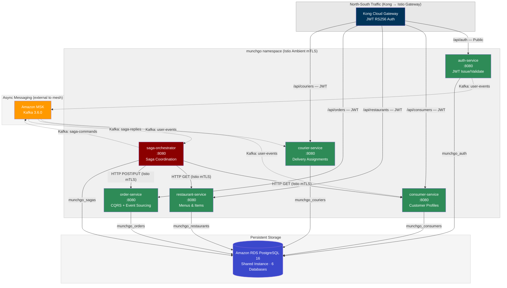

> **Solid arrows** between services = synchronous HTTP calls, encrypted by Istio ztunnel mTLS and authorized by waypoint L7 policy.
> **Dashed arrows** to/from Kafka = asynchronous events, external to the mesh (Amazon MSK).

### Service Details

| Service | Port | Database | Kong Route | Auth | Pattern |
|---------|------|----------|------------|------|---------|
| **auth-service** | 8080 | munchgo_auth | `/api/auth` | Public | JWT RS256 issuer |
| **consumer-service** | 8080 | munchgo_consumers | `/api/consumers` | JWT | CRUD |
| **restaurant-service** | 8080 | munchgo_restaurants | `/api/restaurants` | JWT | CRUD |
| **order-service** | 8080 | munchgo_orders | `/api/orders` | JWT | CQRS + Event Sourcing |
| **courier-service** | 8080 | munchgo_couriers | `/api/couriers` | JWT | CRUD |
| **saga-orchestrator** | 8080 | munchgo_sagas | *Internal only* | Mesh mTLS | Saga Orchestration |

### Authentication & JWT Flow

Custom JWT implementation using **RS256 asymmetric signing** (2048-bit RSA). No external IDP (Keycloak, Auth0, Cognito) — the Auth Service handles registration, login, and token issuance. Kong validates tokens at the edge; backend services trust Kong's verification.

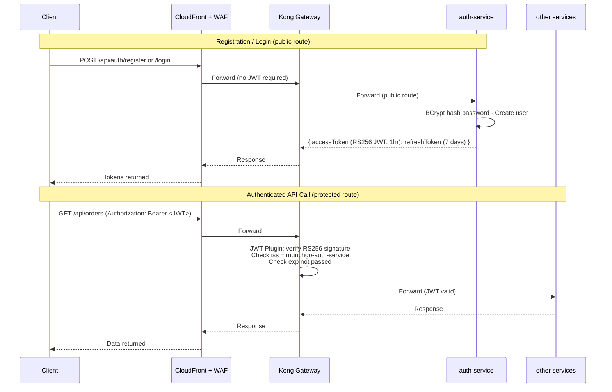

**JWT token structure:**
- Algorithm: RS256 (RSA + SHA-256)
- Claims: `sub` (userId), `iss` (munchgo-auth-service), `username`, `email`, `roles[]`, `iat`, `exp`
- Access token: 1 hour expiry
- Refresh token: 7 days, stored in database, supports rotation

**Kong JWT verification:**
- Kong matches the `iss` claim to a registered consumer credential
- Verifies the RS256 signature using the Auth Service's public key
- Protected routes: `/api/consumers`, `/api/orders`, `/api/couriers`, `/api/restaurants` (POST/PUT)
- Public routes: `/api/auth/*` (register, login, refresh, logout), `/healthz`

**User registration triggers Kafka events:**
- Auth Service publishes `UserRegisteredEvent` to the `user-events` Kafka topic
- Consumer Service auto-creates a Consumer profile (for `ROLE_CUSTOMER` users)
- Courier Service auto-creates a Courier profile (for `ROLE_COURIER` users)

### Order Saga Flow

The saga orchestrator uses a **hybrid approach**: synchronous HTTP calls (via Istio mTLS) for validation and order management, and asynchronous Kafka commands for courier assignment. Circuit breakers (Resilience4j) protect all HTTP calls.

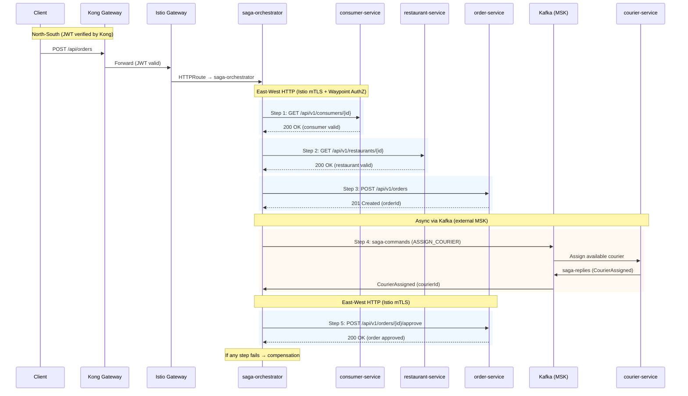

**Why hybrid?** Steps 1-3 and 5 need immediate responses (is the consumer valid? does the restaurant exist?) — synchronous HTTP is appropriate. Step 4 uses Kafka because courier assignment may take time (finding an available courier), making async messaging the better fit.

#### Kafka Topics

| Topic | Publisher | Consumer | Purpose |
|-------|-----------|----------|---------|
| `user-events` | Auth Service | Consumer Service, Courier Service | Auto-create profile on user registration |
| `saga-commands` | Saga Orchestrator | Courier Service | Assign courier to order |
| `saga-replies` | Courier Service | Saga Orchestrator | Courier assignment result |

---

## Repository Structure

### Three-Repo GitOps Model

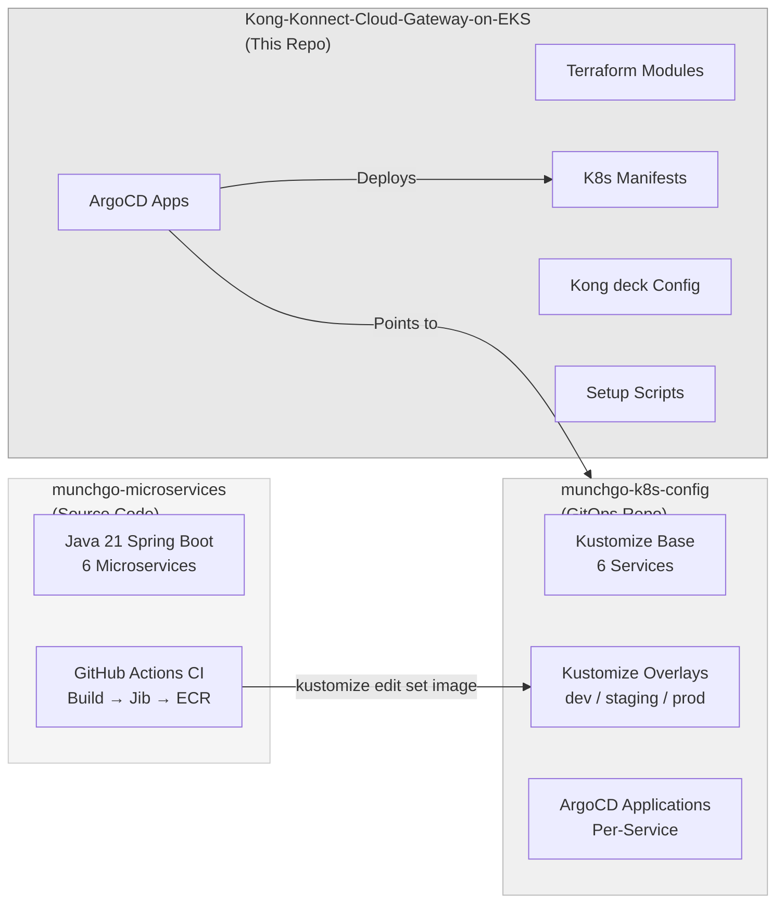

| Repository | Purpose | Branch |
|------------|---------|--------|
| [`Kong-Konnect-Cloud-Gateway-on-EKS`](https://github.com/shanaka-versent/Kong-Konnect-Cloud-Gateway-on-EKS) | Infrastructure, K8s manifests, ArgoCD, Kong config | `feature/istio-servicemesh` |
| [`munchgo-k8s-config`](https://github.com/shanaka-versent/munchgo-k8s-config) | GitOps — Kustomize manifests for MunchGo deployments | `main` |
| [`munchgo-microservices`](https://github.com/shanaka-versent/munchgo-microservices) | Source code — Java 21 Spring Boot microservices + CI | `main` |

### This Repo — Directory Layout

```
.
├── argocd/apps/                    # ArgoCD App of Apps (sync wave ordered)
│   ├── root-app.yaml               #   Root application (bootstrapped by Terraform)
│   ├── 00-gateway-api-crds.yaml    #   Wave -2: Gateway API CRDs
│   ├── 01-namespaces.yaml          #   Wave  1: Namespaces (ambient labeled)
│   ├── 02-istio-base.yaml          #   Wave -1: Istio CRDs
│   ├── 03-istiod.yaml              #   Wave  0: Istio control plane
│   ├── 04-istio-cni.yaml           #   Wave  0: Istio CNI plugin
│   ├── 05-ztunnel.yaml             #   Wave  0: ztunnel L4 mTLS
│   ├── 06-gateway.yaml             #   Wave  5: Istio Gateway (internal NLB)
│   ├── 07-httproutes.yaml          #   Wave  6: HTTPRoutes for MunchGo APIs
│   ├── 08-apps.yaml                #   Wave  7: Platform apps (health-responder)
│   ├── 09-external-secrets.yaml    #   Wave  8: External Secrets Operator (Helm)
│   ├── 09-munchgo-apps.yaml        #   Wave  8: Layer 3→4 bridge (munchgo-k8s-config repo)
│   ├── 09-external-secrets-config.yaml # Wave 9: ClusterSecretStore + ExternalSecrets
│   ├── 10-istio-mesh-policies.yaml #   Wave 10: Waypoint, AuthZ, PeerAuth, Telemetry
│   ├── 11-prometheus.yaml          #   Wave 11: Prometheus + Grafana
│   ├── 12-jaeger.yaml              #   Wave 12: Jaeger distributed tracing
│   └── 12-kiali.yaml               #   Wave 12: Kiali service mesh dashboard
├── deck/
│   └── kong.yaml                   # Kong Gateway configuration (decK format)
├── k8s/
│   ├── namespace.yaml              # Namespace definitions (ambient mesh labeled)
│   ├── apps/
│   │   └── health-responder.yaml   # Gateway health check endpoint
│   ├── external-secrets/
│   │   ├── cluster-secret-store.yaml   # AWS Secrets Manager ClusterSecretStore
│   │   └── munchgo-db-secret.yaml      # ExternalSecrets for 6 service databases
│   └── istio/
│       ├── gateway.yaml            # Istio Gateway (internal NLB + TLS)
│       ├── httproutes.yaml         # MunchGo API routes + ReferenceGrants
│       ├── waypoint.yaml           # Waypoint proxy (L7 in ambient mesh)
│       ├── authorization-policies.yaml # East-west access control
│       ├── peer-authentication.yaml    # Strict mTLS enforcement
│       ├── telemetry.yaml          # Jaeger tracing + Prometheus metrics
│       └── tls-secret.yaml         # TLS secret reference
├── scripts/
│   ├── 01-generate-certs.sh        # Generate TLS certs + K8s secret
│   ├── 02-setup-cloud-gateway.sh   # Fully automated Kong Konnect setup
│   ├── 02-generate-jwt.sh          # Generate JWT tokens for testing
│   ├── 03-post-terraform-setup.sh  # Post-apply NLB endpoint discovery
│   └── destroy.sh                  # Full stack teardown (correct order)
└── terraform/
    ├── main.tf                     # Root module — orchestrates all modules
    ├── variables.tf                # All configurable parameters
    ├── outputs.tf                  # Stack outputs (endpoints, ARNs, etc.)
    ├── providers.tf                # AWS provider configuration
    └── modules/
        ├── vpc/                    # VPC, subnets, NAT, IGW
        ├── eks/                    # EKS cluster + system/user node pools
        ├── iam/                    # LB Controller IRSA + External Secrets IRSA
        ├── lb-controller/          # AWS Load Balancer Controller (Helm)
        ├── argocd/                 # ArgoCD + root app bootstrap
        ├── cloudfront/             # CloudFront + WAF + Origin mTLS
        ├── ecr/                    # 6 ECR repositories (MunchGo services)
        ├── msk/                    # Amazon MSK Kafka cluster
        ├── rds/                    # RDS PostgreSQL + Secrets Manager
        └── spa/                    # S3 bucket for React SPA
```

---

## GitOps Pipeline

### CI/CD Flow

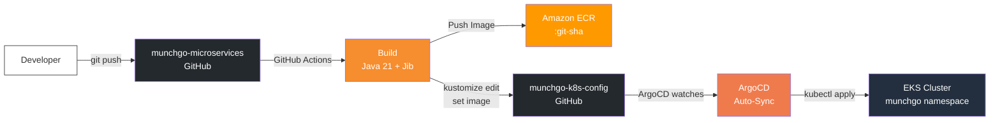

1. Developer pushes code to `munchgo-microservices`
2. **GitHub Actions** builds the container image using Jib (no Docker daemon needed)
3. Image is pushed to **Amazon ECR** with the git SHA as the tag
4. CI updates the **kustomize overlay** in `munchgo-k8s-config` via `kustomize edit set image`
5. **ArgoCD** detects the change and auto-syncs the new deployment to EKS

### ArgoCD Sync Wave Ordering

```mermaid
gantt
    title ArgoCD Sync Wave Deployment Order
    dateFormat X
    axisFormat %s

    section Infrastructure
    Gateway API CRDs (wave -2)          :a1, 0, 1
    Istio Base CRDs (wave -1)           :a2, 1, 2
    istiod + CNI + ztunnel (wave 0)     :a3, 2, 3
    Namespaces (wave 1)                 :a4, 3, 4

    section Service Mesh
    Istio Gateway + NLB (wave 5)        :b1, 4, 5
    HTTPRoutes (wave 6)                 :b2, 5, 6

    section Applications
    Platform Apps (wave 7)              :c1, 6, 7
    External Secrets + MunchGo (wave 8) :c2, 7, 8
    SecretStore Config (wave 9)         :c3, 8, 9

    section Mesh Policies
    Waypoint + AuthZ + mTLS (wave 10)   :d1, 9, 10

    section Observability
    Prometheus + Grafana (wave 11)      :e1, 10, 11
    Kiali + Jaeger (wave 12)            :e2, 11, 12
```

| Wave | Application | What Gets Deployed |
|------|-------------|-------------------|
| -2 | gateway-api-crds | `Gateway`, `HTTPRoute`, `ReferenceGrant` CRDs |
| -1 | istio-base | Istio CRDs and cluster-wide resources |
| 0 | istiod, istio-cni, ztunnel | Ambient mesh control + data plane |
| 1 | namespaces | `munchgo`, `external-secrets`, `observability` (ambient labeled) |
| 5 | gateway | Istio Gateway → creates single internal NLB |
| 6 | httproutes | `/api/auth`, `/api/consumers`, `/api/restaurants`, `/api/orders`, `/api/couriers` |
| 7 | platform-apps | health-responder |
| 8 | external-secrets, munchgo-apps | ESO Helm chart + MunchGo services (from GitOps repo) |
| 9 | external-secrets-config | ClusterSecretStore + ExternalSecrets (DB credentials) |
| 10 | istio-mesh-policies | Waypoint proxy, AuthorizationPolicy, PeerAuthentication, Telemetry |
| 11 | prometheus-stack | kube-prometheus-stack + Grafana dashboards |
| 12 | kiali, jaeger | Service mesh dashboard + distributed tracing |

### Architecture Layers

System nodes handle critical add-ons (tainted with `CriticalAddonsOnly`), while User nodes run application workloads. DaemonSets (istio-cni, ztunnel) run on **all** nodes via tolerations.

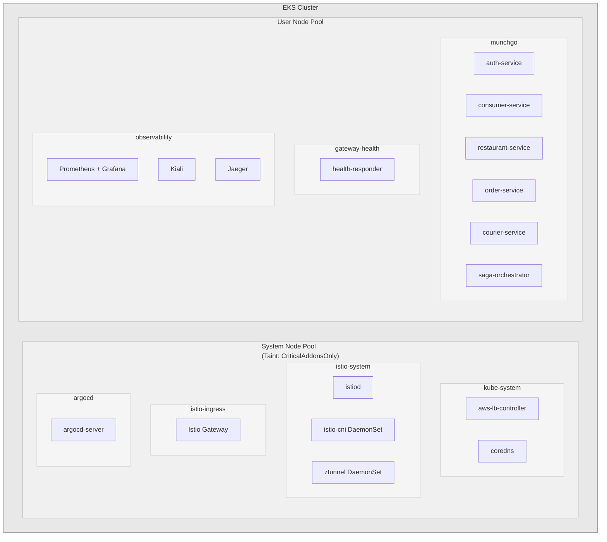

---

## Prerequisites

- AWS CLI configured with credentials
- Terraform >= 1.5
- kubectl + Helm 3
- [decK CLI](https://docs.konghq.com/deck/latest/)
- [Kong Konnect](https://konghq.com/products/kong-konnect) account with Dedicated Cloud Gateway entitlement

---

## Deployment

Seven steps, zero manual console clicks. Terraform handles infrastructure in two phases (CloudFront depends on the Kong proxy URL from Step 5), ArgoCD syncs K8s resources, and scripts automate Konnect setup.

### Deployment Layers

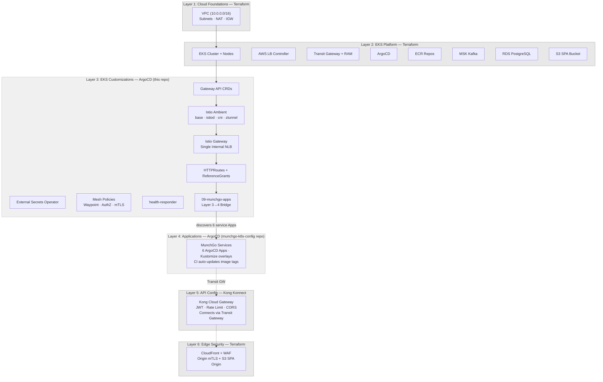

### Step 1: Configure Konnect Credentials

```bash
cp .env.example .env
```

Edit `.env` — only **3 values** needed:

```bash
KONNECT_REGION="au"
KONNECT_TOKEN="kpat_your_token_here"
KONNECT_CONTROL_PLANE_NAME="kong-cloud-gateway-eks"
```

> `.env` is **gitignored** — your token never gets committed. All scripts auto-source it.

### Step 2: Deploy Infrastructure + GitOps

```bash
terraform -chdir=terraform init
terraform -chdir=terraform apply
```

This creates Layers 1-3 in one shot:
- VPC, EKS cluster, node groups (system + user), AWS LB Controller, Transit Gateway + RAM share
- **ECR** (6 repositories), **MSK** (Kafka), **RDS** (PostgreSQL + 6 databases), **S3** (SPA bucket)
- ArgoCD + **root application** (App of Apps) — bootstrapped automatically

ArgoCD immediately begins syncing all Layer 3 child apps via **sync waves** in dependency order (see table above). The `09-munchgo-apps.yaml` bridge app (sync wave 8) discovers Layer 4 service Applications from the `munchgo-k8s-config` GitOps repo.

> CloudFront + WAF (Layer 6) is deployed in Step 7 after the Kong proxy URL is available.

### Step 3: Configure kubectl

```bash
aws eks update-kubeconfig \
  --name $(terraform -chdir=terraform output -raw cluster_name) \
  --region ap-southeast-2
```

### Step 4: Generate TLS Certificates

```bash
./scripts/01-generate-certs.sh
```

Generates a self-signed CA + server certificate and **automatically creates** the `istio-gateway-tls` Kubernetes secret.

### Step 5: Set Up Kong Cloud Gateway

```bash
./scripts/02-setup-cloud-gateway.sh
```

Fully automates Konnect and AWS setup:
1. Creates Konnect control plane (`cloud_gateway: true`)
2. Provisions Cloud Gateway network (~30 minutes)
3. Shares Transit Gateway via AWS RAM
4. Auto-accepts TGW attachment

### Step 6: Configure Kong Routes

```bash
./scripts/03-post-terraform-setup.sh
```

Update `deck/kong.yaml` with the NLB hostname, then sync:

```bash
deck gateway sync deck/kong.yaml \
  --konnect-addr https://${KONNECT_REGION}.api.konghq.com \
  --konnect-token $KONNECT_TOKEN \
  --konnect-control-plane-name $KONNECT_CONTROL_PLANE_NAME
```

### Step 7: Deploy CloudFront + WAF

Get the **Public Edge DNS** from Konnect UI → Gateway Manager → Connect.

```hcl
# terraform/terraform.tfvars
kong_cloud_gateway_domain = "<hash>.aws-ap-southeast-2.edge.gateways.konggateway.com"
```

```bash
terraform -chdir=terraform apply
```

---

## Verification

```bash
# Istio Ambient components
kubectl get pods -n istio-system

# Gateway + NLB
kubectl get gateway -n istio-ingress
kubectl get gateway -n istio-ingress kong-cloud-gw-gateway \
  -o jsonpath='{.status.addresses[0].value}'

# HTTPRoutes
kubectl get httproute -A

# MunchGo services
kubectl get pods -n munchgo
kubectl get svc -n munchgo

# Waypoint proxy
kubectl get gateway -n munchgo munchgo-waypoint

# Mesh policies
kubectl get peerauthentication -n munchgo
kubectl get authorizationpolicy -n munchgo

# External Secrets
kubectl get externalsecret -n munchgo
kubectl get secret -n munchgo

# End-to-end test
export APP_URL=$(terraform -chdir=terraform output -raw application_url)
curl $APP_URL/healthz
curl $APP_URL/api/auth/health
curl -H "Authorization: Bearer <jwt>" $APP_URL/api/orders
```

---

## Observability

### Observability Stack

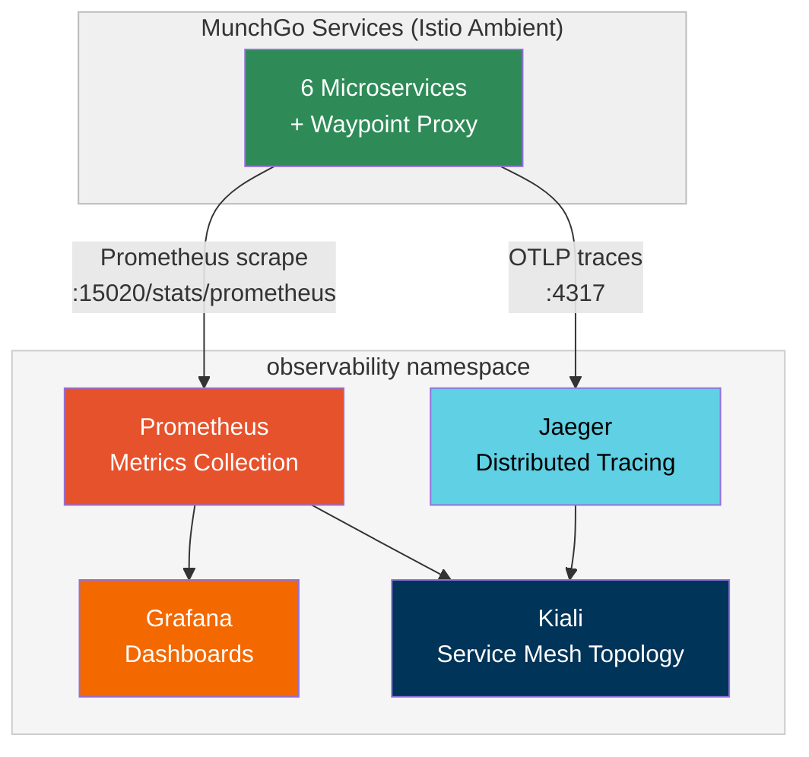

| Tool | Access | Purpose |
|------|--------|---------|
| **Grafana** | `kubectl port-forward svc/prometheus-stack-grafana -n observability 3000:80` | Metrics dashboards (Istio, K8s, MunchGo) |
| **Kiali** | `kubectl port-forward svc/kiali -n observability 20001:20001` | Service mesh topology, traffic flow visualization |
| **Jaeger** | `kubectl port-forward svc/jaeger-query -n observability 16686:16686` | Distributed traces across microservices |
| **Prometheus** | `kubectl port-forward svc/prometheus-stack-kube-prom-prometheus -n observability 9090:9090` | Raw metrics queries (PromQL) |

### ArgoCD UI

```bash
terraform -chdir=terraform output -raw argocd_admin_password
kubectl port-forward svc/argocd-server -n argocd 8080:80
# Open http://localhost:8080 (user: admin)
```

---

## Konnect UI

Once deployed, everything is visible at [cloud.konghq.com](https://cloud.konghq.com):

| Feature | Where in Konnect UI |
|---------|-------------------|
| **API Analytics** | Analytics → Dashboard (request counts, latency P50/P95/P99, error rates) |
| **Gateway Health** | Gateway Manager → Data Plane Nodes (status, connections) |
| **Routes & Services** | Gateway Manager → Routes / Services |
| **Plugins** | Gateway Manager → Plugins (JWT, rate limiting, CORS, transforms) |
| **Consumers** | Gateway Manager → Consumers (JWT credentials, usage) |

---

## Teardown

```bash
./scripts/destroy.sh
```

Tears down the **full stack** in the correct order:

1. **Delete Istio Gateway** → triggers NLB deprovisioning
2. **Wait for NLB/ENI cleanup** → prevents VPC deletion failures
3. **Delete ArgoCD apps** → cascade removes all workloads
4. **Cleanup CRDs** → removes Gateway API and Istio CRDs
5. **Terraform destroy** → removes EKS, VPC, TGW, RAM, ECR, MSK, RDS, S3, CloudFront + WAF
6. **Cleanup CloudFormation stacks** → safety net for orphaned CFN
7. **Delete Konnect resources** → removes Cloud Gateway via API

---

## Terraform Variables Reference

| Variable | Default | Description |
|----------|---------|-------------|
| `region` | `ap-southeast-2` | AWS region |
| `environment` | `poc` | Environment name |
| `project_name` | `kong-gw` | Project name prefix |
| `vpc_cidr` | `10.0.0.0/16` | VPC CIDR block |
| `kubernetes_version` | `1.29` | EKS Kubernetes version |
| `eks_node_instance_type` | `t3.medium` | System node instance type |
| `user_node_instance_type` | `t3.medium` | User node instance type |
| `enable_ecr` | `true` | Create ECR repositories |
| `enable_msk` | `true` | Create MSK Kafka cluster |
| `msk_instance_type` | `kafka.m5.large` | MSK broker instance type |
| `msk_broker_count` | `2` | Number of Kafka brokers |
| `enable_rds` | `true` | Create RDS PostgreSQL |
| `rds_instance_class` | `db.t3.medium` | RDS instance class |
| `rds_multi_az` | `false` | Multi-AZ for production |
| `enable_spa` | `true` | Create S3 SPA bucket |
| `enable_external_secrets` | `true` | External Secrets IRSA |
| `enable_cloudfront` | `true` | CloudFront + WAF |
| `kong_cloud_gateway_domain` | `""` | Kong proxy domain (from Konnect) |
| `enable_waf` | `true` | WAF Web ACL |
| `waf_rate_limit` | `2000` | Requests per 5 min per IP |

---

## Appendix

### CloudFront Origin mTLS — Terraform Workaround

**Problem:** The Terraform AWS provider (as of v6.31) does **not** support `origin_mtls_config` on the `aws_cloudfront_distribution` resource.

**Workaround:** The CloudFront distribution is created via `aws_cloudformation_stack` instead of the native resource, which supports `OriginMtlsConfig` with `ClientCertificateArn`.

See: [`terraform/modules/cloudfront/main.tf`](terraform/modules/cloudfront/main.tf)

**Migration path** (once Terraform provider adds support):
1. Replace `aws_cloudformation_stack.cloudfront` with native `aws_cloudfront_distribution`
2. `terraform state rm` + `terraform import`
3. Delete orphaned CloudFormation stack
