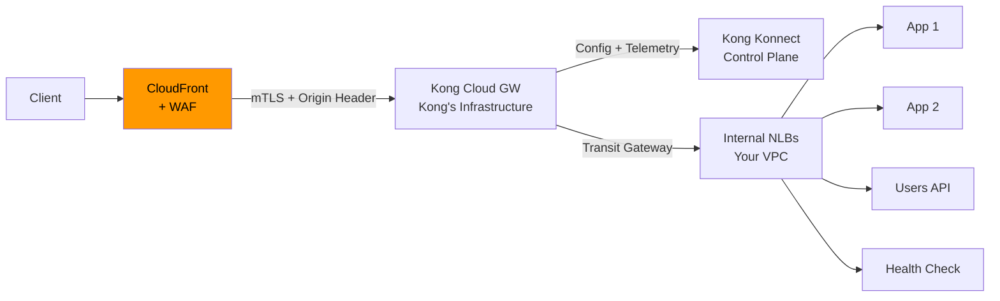
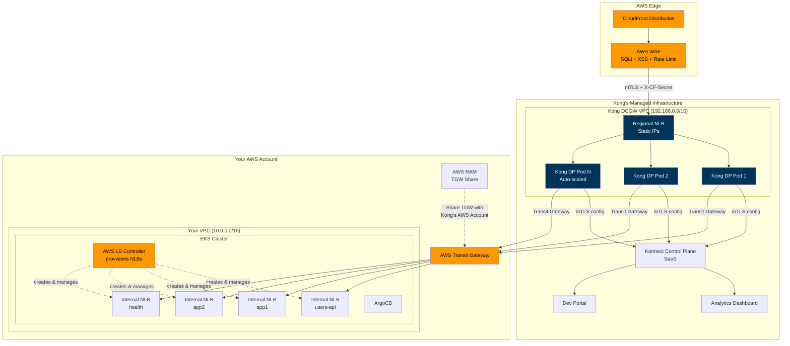
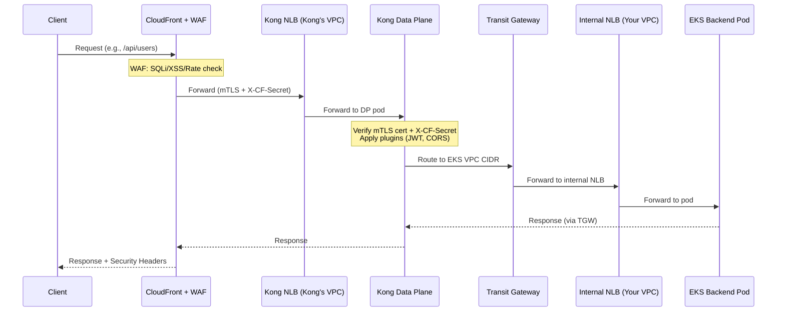
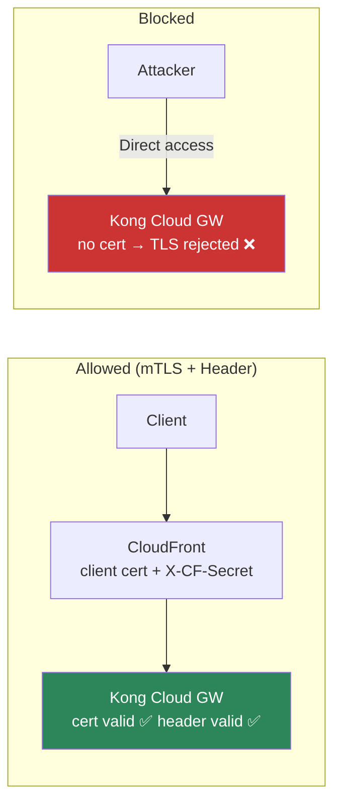
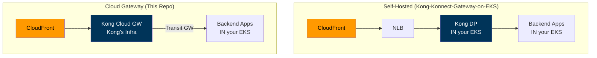

# AWS EKS with Kong Dedicated Cloud Gateway — Fully Managed API Management

This POC demonstrates how to use **Kong Konnect Dedicated Cloud Gateways** with backend services running on **AWS EKS**, fronted by **CloudFront + WAF** for edge security. Kong's data plane runs in Kong's fully managed infrastructure — you only manage the EKS cluster hosting your backend services.

## Background

My previous POCs implemented API gateways using [Istio on EKS](https://github.com/shanaka-versent/EKS-Istio-GatewayAPI-Deom/tree/k8s-gateway-api-poc), [Kong with K8s Gateway API](https://github.com/shanaka-versent/EKS-Kong-GatewayAPI-Demo), and [Kong with Konnect as source](https://github.com/shanaka-versent/Kong-Konnect-Gateway-on-EKS). All of those required running Kong or Istio data plane pods inside the EKS cluster.

This repo takes the **fully managed approach** — Kong's Dedicated Cloud Gateway handles all API gateway infrastructure. You deploy backend services in EKS, expose them via internal NLBs (created by the AWS Load Balancer Controller), and connect Kong to them through an AWS Transit Gateway. CloudFront + WAF sits at the edge for DDoS protection, SQLi/XSS filtering, and rate limiting.

> **Note:** There are no Kubernetes `Ingress` resources, Gateway API CRDs, or service mesh in this pattern. All L7 API gateway logic (routing, authentication, rate limiting) is handled by Kong Cloud Gateway outside the cluster. The **AWS Load Balancer Controller** is installed in the cluster and operates in its **L4 service controller mode** — it watches for `Service type: LoadBalancer` resources and provisions internal NLBs via the AWS API. It is not used in its L7 ingress mode (no `Ingress` or `IngressClass` resources exist). No traffic flows through the controller itself; it's purely control plane automation that keeps NLB target groups in sync with pod IPs.

## Architecture

### High-Level Traffic Flow



### Detailed Architecture



### Network Connectivity



### CloudFront Bypass Prevention

Kong Cloud Gateway has a public NLB. Without protection, attackers could bypass CloudFront/WAF by hitting Kong's proxy URL directly. This repo implements **two layers** of bypass prevention — either or both can be enabled:



| Technique | How It Works | Status |
|-----------|-------------|--------|
| **Origin mTLS** (recommended) | CloudFront presents client certificate during TLS handshake; Kong rejects connections without valid cert. Cryptographic proof of identity. | ✅ Implemented |
| **Custom origin header** | CloudFront injects `X-CF-Secret`; Kong `pre-function` plugin validates it and returns 403 if missing. Application-layer shared secret. | ✅ Implemented |
| **IP allowlisting** | Kong Cloud Gateway provides static egress NAT IPs for allowlisting | ℹ️ Optional (contact Kong) |

> **Recommendation:** Use **origin mTLS** — it's the strongest option (cryptographic, not a shared secret). The custom header is optional defense-in-depth. mTLS alone is sufficient for bypass prevention.

#### Origin mTLS Setup

1. Create a private CA (AWS Private CA or third-party)
2. Issue a client certificate with **Extended Key Usage = clientAuth**
3. Import the certificate into ACM in **us-east-1**
4. Pass the certificate ARN to Terraform:
   ```bash
   terraform apply -var="origin_mtls_certificate_arn=arn:aws:acm:us-east-1:123456789012:certificate/abc-123"
   ```
5. Configure Kong Cloud Gateway to require client certificates (contact Kong support or configure via Konnect)

### What's Different from Self-Hosted Kong



| Aspect | Self-Hosted (Previous Repo) | Cloud Gateway (This Repo) |
|--------|----------------------------|---------------------------|
| Kong DP runs in | Your EKS cluster | Kong's managed infrastructure |
| You manage | Everything (infra + Kong + apps) | Only backend apps in EKS |
| K8s ingress/gateway | None (Kong DP pods in cluster) | AWS LB Controller (L4 only — no `Ingress` or Gateway API resources) |
| Service exposure | ClusterIP (Kong DP in same cluster) | `Service type: LoadBalancer` → internal NLBs via AWS LB Controller |
| Scaling | Manual (HPA, node scaling) | Autopilot (auto-scales on RPS) |
| Upgrades | Manual (Helm rolling updates) | Automatic with traffic shifting |
| Network path | CloudFront → VPC Origin → NLB → Kong (private) | CloudFront → Kong NLB (public) → Transit GW → internal NLBs |
| CF bypass prevention | Not needed (VPC Origin = private) | Origin mTLS (recommended) + custom header (optional) |
| WAF | AWS WAF on CloudFront | AWS WAF on CloudFront |
| SLA | Your responsibility | 99.99% from Kong |

## Prerequisites

- **AWS CLI** configured with appropriate credentials
- **Terraform** >= 1.5
- **kubectl** configured for EKS cluster access
- **Helm** >= 3.x
- **Kong Konnect account** with Cloud Gateway entitlement — [cloud.konghq.com](https://cloud.konghq.com)
- **Konnect Personal Access Token** — [Generate one](https://cloud.konghq.com/global/account/tokens)
- **decK** (optional) — [Install decK](https://docs.konghq.com/deck/latest/installation/)

### AWS Configuration

```bash
export AWS_PROFILE=stax-stax-au1-versent-innovation
export AWS_REGION=ap-southeast-2
```

## Deployment Steps

### Step 1: Deploy Infrastructure (Terraform)

```bash
cd terraform
terraform init
terraform plan
terraform apply
```

This creates:
- VPC with public/private subnets across 2 AZs
- EKS cluster with managed node groups
- AWS Load Balancer Controller — operates in L4 mode, watches `Service type: LoadBalancer` and provisions internal NLBs (no L7 `Ingress` resources used)
- **AWS Transit Gateway** + RAM share (for Kong Cloud Gateway connectivity)
- ArgoCD installation

To enable CloudFront + WAF with **origin mTLS** (recommended):

```bash
terraform apply \
  -var="enable_cloudfront=true" \
  -var="kong_cloud_gateway_domain=<your-proxy-url>.au.kong-cloud.com" \
  -var="origin_mtls_certificate_arn=arn:aws:acm:us-east-1:123456789012:certificate/abc-123"
```

Or with **custom origin header** (simpler, application-layer):

```bash
terraform apply \
  -var="enable_cloudfront=true" \
  -var="kong_cloud_gateway_domain=<your-proxy-url>.au.kong-cloud.com" \
  -var="cf_origin_header_value=$(openssl rand -hex 32)"
```

Or **both** (defense-in-depth):

```bash
terraform apply \
  -var="enable_cloudfront=true" \
  -var="kong_cloud_gateway_domain=<your-proxy-url>.au.kong-cloud.com" \
  -var="origin_mtls_certificate_arn=arn:aws:acm:us-east-1:123456789012:certificate/abc-123" \
  -var="cf_origin_header_value=$(openssl rand -hex 32)"
```

### Step 2: Deploy Backend Services (ArgoCD)

```bash
kubectl apply -f argocd/apps/root-app.yaml
kubectl get applications -n argocd -w
```

ArgoCD deploys backend services, each with a `Service type: LoadBalancer` (internal NLB annotation). The AWS Load Balancer Controller automatically provisions an internal NLB per service and registers pod IPs as targets:
- `users-api` → Internal NLB
- `sample-app-1` → Internal NLB
- `sample-app-2` → Internal NLB
- `health-responder` → Internal NLB

Once all applications are synced, get the internal NLB DNS names — you'll need them for Konnect service configuration:

```bash
./scripts/03-post-terraform-setup.sh

# Or manually:
kubectl get svc -A -o wide | grep LoadBalancer
```

### Step 3: Set Up Kong Cloud Gateway (Konnect)

```bash
export KONNECT_REGION="au"
export KONNECT_TOKEN="kpat_xxx..."
export TRANSIT_GATEWAY_ID=$(terraform -chdir=terraform output -raw transit_gateway_id)
export RAM_SHARE_ARN=$(terraform -chdir=terraform output -raw ram_share_arn)
export EKS_VPC_CIDR=$(terraform -chdir=terraform output -raw vpc_cidr)

./scripts/01-setup-cloud-gateway.sh
```

This script:
1. Creates a Konnect control plane
2. Provisions a Cloud Gateway network in `ap-southeast-2` (~30 min)
3. Creates a data plane group (Autopilot mode)
4. Attaches the Transit Gateway

**Alternative:** Use the Konnect UI (Gateway Manager → Create → Dedicated Cloud Gateway) or the [Konnect Terraform provider](https://registry.terraform.io/providers/Kong/konnect/latest).

### Step 4: Accept Transit Gateway Attachment

After the Cloud Gateway network is provisioned:

1. Go to **AWS Console → VPC → Transit Gateway Attachments**
2. Find the pending attachment from Kong's account
3. **Accept** the attachment
4. Verify routes in the Transit Gateway route table

### Step 5: Configure Routes in Konnect

Update `deck/kong.yaml` with the actual internal NLB DNS names:

```yaml
services:
  - name: users-api
    url: http://<actual-users-api-nlb-dns>:80
    ...
```

Then sync to Konnect:

```bash
deck gateway sync -s deck/kong.yaml \
  --konnect-addr https://au.api.konghq.com \
  --konnect-token $KONNECT_TOKEN \
  --konnect-control-plane-name kong-cloud-gateway-eks
```

### Step 6: Enable CloudFront Bypass Prevention (Optional)

If you enabled CloudFront in Step 1, bypass prevention ensures attackers can't hit Kong's public NLB directly to skip WAF.

**Origin mTLS** (recommended — no Kong-side config needed):
- If you passed `origin_mtls_certificate_arn` in Step 1, mTLS is already active.
- CloudFront presents the client certificate during TLS handshake; Kong rejects connections without a valid cert.
- Configure Kong Cloud Gateway to require client certificates (contact Kong support or configure via Konnect).

**Custom origin header** (optional defense-in-depth):
1. Edit `deck/kong.yaml` — uncomment the `pre-function` plugin
2. Replace `<YOUR_CF_ORIGIN_SECRET>` with the same value used for `cf_origin_header_value`
3. Re-sync to Konnect:
   ```bash
   deck gateway sync -s deck/kong.yaml \
     --konnect-addr https://au.api.konghq.com \
     --konnect-token $KONNECT_TOKEN \
     --konnect-control-plane-name kong-cloud-gateway-eks
   ```

> **Tip:** mTLS alone is sufficient for bypass prevention. The custom header adds application-layer defense-in-depth but is not required if mTLS is enabled.

### Step 7: Test

```bash
# Get the application URL
# If CloudFront enabled: use CloudFront domain
export APP_URL=$(terraform -chdir=terraform output -raw application_url)
# If CloudFront not enabled: use Kong Cloud Gateway proxy URL from Konnect dashboard
# export APP_URL="https://<your-cloud-gw-proxy-url>"

# Test health
curl -s $APP_URL/healthz

# Test apps
curl -s $APP_URL/app1
curl -s $APP_URL/app2

# Test authenticated API
TOKEN=$(./scripts/02-generate-jwt.sh | grep "^ey")
curl -s -H "Authorization: Bearer $TOKEN" $APP_URL/api/users | jq .

# Verify CloudFront bypass prevention
# With mTLS: connection rejected (TLS handshake fails without client cert)
# With custom header: returns 403 (missing X-CF-Secret)
# curl -s "https://<kong-cloud-gw-proxy-url>/healthz"
```

## Observability & Troubleshooting

With Dedicated Cloud Gateway, the telemetry subsystem is fully active — all metrics (request volume, latency P50/P95/P99, status codes, bandwidth, consumer analytics) flow to Konnect automatically. View at: https://cloud.konghq.com → Analytics

### Transit Gateway Connectivity

```bash
# Verify Transit Gateway exists
aws ec2 describe-transit-gateways --filter Name=tag:Name,Values="*kong*"

# Check TGW attachments (should show both your VPC and Kong's)
aws ec2 describe-transit-gateway-attachments --filter Name=transit-gateway-id,Values=$(terraform -chdir=terraform output -raw transit_gateway_id)

# Check route tables include Kong CIDR
aws ec2 describe-route-tables --filter Name=vpc-id,Values=$(terraform -chdir=terraform output -raw vpc_id) | jq '.RouteTables[].Routes[] | select(.DestinationCidrBlock == "192.168.0.0/16")'
```

### Internal NLB Endpoints

```bash
# Check all internal NLBs are provisioned
kubectl get svc -A -o wide | grep LoadBalancer

# If NLB is stuck in "pending":
# - Check AWS LB Controller is running
kubectl get pods -n kube-system | grep aws-load-balancer

# - Check service annotations are correct
kubectl describe svc users-api -n api
```

### ArgoCD Application Status

```bash
# Check all ArgoCD applications
kubectl get applications -n argocd

# Check a specific application
kubectl get app users-api -n argocd -o yaml
```

**Access ArgoCD UI:**

```bash
# Port-forward the ArgoCD server
kubectl port-forward svc/argocd-server -n argocd 8080:443

# Get the initial admin password
kubectl -n argocd get secret argocd-initial-admin-secret -o jsonpath="{.data.password}" | base64 -d
```

Then open https://localhost:8080 in your browser. Login with username `admin` and the password from the command above.

### Kong Cloud Gateway Status

Check in Konnect dashboard:
- **Gateway Manager → Data Plane Nodes**: Should show healthy data plane pods
- **Gateway Manager → Networks**: Network status should be "Ready"
- **Gateway Manager → Transit Gateways**: Attachment should be "Active"

### CloudFront + WAF

```bash
# Check CloudFront distribution status
aws cloudfront get-distribution --id $(terraform -chdir=terraform output -raw cloudfront_distribution_id) | jq '.Distribution.Status'

# Check WAF metrics
aws cloudwatch get-metric-statistics \
  --namespace "AWS/WAFV2" \
  --metric-name "AllowedRequests" \
  --dimensions Name=WebACL,Value=$(terraform -chdir=terraform output -raw waf_web_acl_arn | awk -F'/' '{print $NF}') \
  --start-time $(date -u -v-1H +%Y-%m-%dT%H:%M:%S) \
  --end-time $(date -u +%Y-%m-%dT%H:%M:%S) \
  --period 300 \
  --statistics Sum

# Verify CloudFront bypass prevention
# Direct to Kong (mTLS: TLS handshake fails; custom header: returns 403):
curl -s "https://<kong-cloud-gw-proxy-url>/healthz"

# Via CloudFront (should succeed):
curl -s "https://<cloudfront-domain>/healthz"
```

### DNS Resolution

If Kong Cloud Gateway can't reach your services:
1. Verify Transit Gateway attachment is accepted and active
2. Verify VPC route tables have a route for Kong CIDR → Transit Gateway
3. Verify Security Groups allow inbound from Kong CIDR (192.168.0.0/16)
4. Verify internal NLBs are healthy:
   ```bash
   aws elbv2 describe-target-health --target-group-arn <tg-arn>
   ```

## Teardown

```bash
# Tear down EKS infrastructure (including CloudFront if enabled)
./scripts/destroy.sh

# Then delete Cloud Gateway in Konnect (separate infrastructure):
# Option A: Konnect UI → Gateway Manager → Delete
# Option B: Konnect API or Terraform
```

> **Important:** The Cloud Gateway runs in Kong's infrastructure and must be deleted separately in Konnect. The `destroy.sh` script only tears down your AWS resources.

## Related Projects

| Repository | Description |
|------------|-------------|
| [Kong-Konnect-Gateway-on-EKS](https://github.com/shanaka-versent/Kong-Konnect-Gateway-on-EKS) | Kong on EKS with Konnect as source (self-hosted DP, full Konnect features) |
| [EKS-Kong-GatewayAPI-Demo](https://github.com/shanaka-versent/EKS-Kong-GatewayAPI-Demo) | Kong on EKS with K8s Gateway API (KIC + Gateway Discovery) |
| [EKS-Istio-GatewayAPI-Demo](https://github.com/shanaka-versent/EKS-Istio-GatewayAPI-Deom/tree/k8s-gateway-api-poc) | Istio Gateway API on AWS EKS |
| [AKS-Istio-GatewayAPI-Demo](https://github.com/shanaka-versent/AKS-Istio-GatewayAPI-Demo/tree/k8s-gateway-api-poc) | Istio Gateway API on Azure AKS |
