# Kong Dedicated Cloud Gateway on EKS with Istio Gateway API (Ambient Mesh)

Kong Konnect Dedicated Cloud Gateway with backend services on AWS EKS. Kong's API gateway runs **externally in Kong's AWS account** — fully managed, with JWT auth, rate limiting, CORS, and analytics all visible in the [Konnect UI](https://cloud.konghq.com). Backend services in EKS sit behind a **single Istio Gateway internal NLB**, connected to Kong via **AWS Transit Gateway** over private networking. **CloudFront + WAF** provides edge security with origin mTLS bypass prevention. **Istio Ambient mesh** adds automatic L4 mTLS between all pods — no sidecars needed.

---

## Architecture

Two AWS accounts are involved. Traffic never touches the public internet between Kong and EKS.


### End-to-End Encryption

TLS terminates and re-encrypts at each trust boundary. Traffic is encrypted at every hop.

```mermaid
graph LR
    C([Client]) -->|"🔒 TLS 1.3"| CF
    CF[CloudFront<br/>+ WAF] -->|"🔒 HTTPS +<br/>Origin mTLS cert"| Kong
    Kong[Kong Cloud<br/>Gateway] -->|"🔒 HTTPS<br/>via Transit GW"| NLB[Internal<br/>NLB]
    NLB -->|"🔒 TLS"| IGW[Istio Gateway<br/>TLS Terminate]
    IGW -->|"🔒 mTLS<br/>ztunnel L4"| Pod[Backend<br/>Pod]

    style C fill:#fff,stroke:#333,color:#333
    style CF fill:#F68D2E,color:#fff
    style Kong fill:#003459,color:#fff
    style NLB fill:#232F3E,color:#fff
    style IGW fill:#466BB0,color:#fff
    style Pod fill:#2E8B57,color:#fff
```



| Hop | Protocol | Encryption | Terminates At |
|-----|----------|-----------|---------------|
| Client → CloudFront | HTTPS | TLS 1.2/1.3 (AWS-managed cert) | CloudFront edge |
| CloudFront → Kong | HTTPS | TLS + Origin mTLS client certificate | Kong Cloud Gateway |
| Kong → NLB (via TGW) | HTTPS | TLS (private AWS backbone via Transit GW) | Istio Gateway |
| NLB → Istio Gateway | TLS | TLS passthrough (NLB L4) | Istio Gateway (port 443) |
| Istio Gateway → Pod | HTTP | Istio Ambient mTLS (ztunnel L4) | Backend pod |

> The Istio Gateway listens on port 80 (HTTP) and port 443 (HTTPS with `tls.mode: Terminate`). Kong connects on port 443 for end-to-end encryption. The `istio-gateway-tls` secret is created automatically by `./scripts/01-generate-certs.sh`.

### Traffic Flow

```mermaid
sequenceDiagram
    participant C as Client
    participant CF as CloudFront<br/>(+ WAF)
    participant K as Kong Cloud GW<br/>(Kong's AWS Account)
    participant TGW as Transit Gateway
    participant NLB as Internal NLB<br/>(Private)
    participant IG as Istio Gateway<br/>(Pod)
    participant App as Backend App<br/>(Pod)

    Note over C,CF: TLS Session 1 (Edge)
    C->>+CF: HTTPS :443<br/>TLS 1.3 (AWS-managed cert)
    CF->>CF: TLS Termination<br/>WAF Inspection

    Note over CF,K: TLS Session 2 (Origin mTLS)
    CF->>+K: HTTPS :443<br/>Origin mTLS client certificate
    K->>K: TLS Termination<br/>JWT Auth, Rate Limiting,<br/>CORS, Request Transform

    Note over K,IG: TLS Session 3 (Backend)
    K->>+TGW: HTTPS :443<br/>Re-encrypted (private network)
    TGW->>+NLB: HTTPS :443<br/>AWS backbone (192.168.0.0/16 ↔ 10.0.0.0/16)
    NLB->>+IG: HTTPS :443<br/>TLS Passthrough (L4)
    IG->>IG: TLS Termination<br/>(istio-gateway-tls secret)

    Note over IG,App: Plain HTTP (mTLS via Ambient)
    IG->>+App: HTTP :8080<br/>Istio Ambient mTLS (ztunnel L4)
    App-->>-IG: Response
    IG-->>-NLB: Response
    NLB-->>-TGW: Response
    TGW-->>-K: Response
    K-->>-CF: Response
    CF-->>-C: HTTPS Response
```



### Private Connectivity

```mermaid
graph TB
    subgraph your_acct2 ["Your AWS Account"]
        subgraph VPC ["VPC (10.0.0.0/16)"]
            subgraph PrivSubnets [Private Subnets]
                subgraph EKSNodes [EKS Nodes]
                    subgraph ns_istio_system ["istio-system namespace"]
                        istiod_n[istiod — Control Plane]
                        cni_n[istio-cni — DaemonSet]
                        ztunnel_n[ztunnel — L4 mTLS DaemonSet]
                    end
                    subgraph ns_istio_ingress ["istio-ingress namespace"]
                        gw_pod[Istio Gateway Pod]
                    end
                    subgraph ns_gw_health2 ["gateway-health namespace"]
                        health_n[health-responder — ClusterIP]
                    end
                    subgraph ns_sample_apps ["sample-apps namespace"]
                        app1_n[sample-app-1 — ClusterIP]
                        app2_n[sample-app-2 — ClusterIP]
                    end
                    subgraph ns_api2 ["api-services namespace"]
                        api_n[users-api — ClusterIP]
                    end
                end
                INLB[Internal NLB<br/>Created by Istio Gateway<br/>+ AWS LB Controller]
            end
            TGW_Y[Transit Gateway<br/>Created by you<br/>Shared to Kong via AWS RAM]
            RT_Y[Route: 192.168.0.0/16 → TGW]
            SG_Y[SG: Allow inbound<br/>from 192.168.0.0/16]
        end
    end

    subgraph kong_acct2 ["Kong's AWS Account"]
        subgraph KVPC ["DCGW VPC (192.168.0.0/16)"]
            KDP[Kong Data Plane Pods<br/>Auto-scaled · Fully Managed]
            KNLB[Kong Cloud GW NLB<br/>Public · Internet-Facing]
            TGW_K[Transit Gateway Attachment<br/>Kong attaches their VPC]
            RT_K[Route: 10.0.0.0/16 → TGW]
        end
    end

    gw_pod --> INLB
    INLB --- TGW_Y
    TGW_Y <-->|AWS Private Backbone<br/>No Public Internet| TGW_K

    style TGW_Y fill:#232F3E,color:#fff
    style TGW_K fill:#232F3E,color:#fff
    style INLB fill:#232F3E,color:#fff
    style KNLB fill:#003459,color:#fff
    style KDP fill:#003459,color:#fff
    style gw_pod fill:#466BB0,color:#fff
    style istiod_n fill:#466BB0,color:#fff
    style your_acct2 fill:#E8E8E8,stroke:#999,color:#333
    style kong_acct2 fill:#E8E8E8,stroke:#999,color:#333
    style VPC fill:#F0F0F0,stroke:#BBB,color:#333
    style KVPC fill:#F0F0F0,stroke:#BBB,color:#333
    style PrivSubnets fill:#F5F5F5,stroke:#CCC,color:#333
    style EKSNodes fill:#FAFAFA,stroke:#DDD,color:#333
    style ns_istio_system fill:#FAFAFA,stroke:#DDD,color:#333
    style ns_istio_ingress fill:#FAFAFA,stroke:#DDD,color:#333
    style ns_gw_health2 fill:#FAFAFA,stroke:#DDD,color:#333
    style ns_sample_apps fill:#FAFAFA,stroke:#DDD,color:#333
    style ns_api2 fill:#FAFAFA,stroke:#DDD,color:#333
```



How it works:

1. **Terraform** creates an AWS Transit Gateway in your account
2. **AWS RAM** shares the Transit Gateway with Kong's AWS account
3. **Kong** attaches their Cloud Gateway VPC to your Transit Gateway
4. Route tables on both sides direct cross-VPC traffic through the Transit Gateway
5. A security group rule allows inbound from Kong's CIDR (`192.168.0.0/16`)

### Security Layers

| Layer | Component | Protection |
|-------|-----------|------------|
| 1 | CloudFront + WAF | DDoS, SQLi/XSS, rate limiting, geo-blocking |
| 2 | Origin mTLS | CloudFront bypass prevention (via CloudFormation) |
| 3 | Kong Plugins | JWT auth, rate limiting, CORS, request transform |
| 4 | Transit Gateway | Private connectivity — backends never exposed publicly |
| 5 | Istio Ambient mTLS | Automatic L4 encryption between all mesh pods |
| 6 | ClusterIP Services | No direct external access to backend services |

### Architecture Layers

System nodes handle critical add-ons (tainted with `CriticalAddonsOnly`), while User nodes run application workloads. DaemonSets (istio-cni, ztunnel) run on **all** nodes via tolerations.


| Node Pool | Taint | Components | Purpose |
|-----------|-------|------------|---------|
| **System** | `CriticalAddonsOnly=true:NoSchedule` | istiod, istio-cni, ztunnel, aws-lb-controller, ArgoCD, coredns | Infrastructure and mesh control plane |
| **User** | None | health-responder, sample-app-1/2, users-api | Application workloads |

> istiod uses `nodeSelector: node-role: system` to pin to system nodes. istio-cni and ztunnel are DaemonSets with `CriticalAddonsOnly` tolerations so they run on all nodes.

---

## Prerequisites

- AWS CLI configured with credentials
- Terraform >= 1.5
- kubectl + Helm 3
- [decK CLI](https://docs.konghq.com/deck/latest/)
- [Kong Konnect](https://konghq.com/products/kong-konnect) account with Dedicated Cloud Gateway entitlement

---

## Deployment

### Deployment Layers

The stack is deployed in six layers — Terraform provisions infrastructure, ArgoCD handles K8s resources via GitOps, and Kong Konnect manages the external API gateway.

```mermaid
graph TB
    subgraph L1 ["Layer 1: Cloud Foundations — Terraform"]
        VPC["VPC (10.0.0.0/16)<br/>Subnets · NAT · IGW"]
    end

    subgraph L2 ["Layer 2: EKS Platform — Terraform"]
        EKS[EKS Cluster + Nodes]
        LBC[AWS LB Controller]
        TGW2[Transit Gateway + RAM]
        ArgoCD2[ArgoCD]
    end

    subgraph L3 ["Layer 3: Service Mesh — ArgoCD"]
        CRDs[Gateway API CRDs]
        Istio[Istio Ambient<br/>base · istiod · cni · ztunnel]
        GW[Istio Gateway<br/>Single Internal NLB]
        Routes[HTTPRoutes<br/>+ ReferenceGrants]
    end

    subgraph L4 ["Layer 4: Applications — ArgoCD"]
        Apps[Backend Services<br/>All ClusterIP]
    end

    subgraph L5 ["Layer 5: API Config — Kong Konnect"]
        KongGW[Kong Cloud Gateway<br/>Routes · Plugins · Consumers<br/>Connects via Transit Gateway]
    end

    subgraph L6 ["Layer 6: Edge Security — Terraform"]
        CFront[CloudFront + WAF<br/>Origin mTLS]
    end

    VPC --> EKS
    EKS --> CRDs
    CRDs --> Istio
    Istio --> GW
    GW --> Routes
    Routes --> Apps
    Apps -.->|Transit GW| KongGW
    KongGW -.-> CFront

    style L1 fill:#E8E8E8,stroke:#999,color:#333
    style L2 fill:#E8E8E8,stroke:#999,color:#333
    style L3 fill:#F0F0F0,stroke:#BBB,color:#333
    style L4 fill:#F0F0F0,stroke:#BBB,color:#333
    style L5 fill:#E8E8E8,stroke:#999,color:#333
    style L6 fill:#E8E8E8,stroke:#999,color:#333
```



### Step 1: Configure Konnect Credentials

```bash
cp .env.example .env
```

Edit `.env` — only **3 values** needed:

```bash
KONNECT_REGION="au"
KONNECT_TOKEN="kpat_your_token_here"
KONNECT_CONTROL_PLANE_NAME="kong-cloud-gateway-eks"
```

> `.env` is **gitignored** — your token never gets committed. All scripts auto-source it. Transit Gateway IDs and NLB DNS are **auto-read from Terraform** — no manual entry needed.

### Step 2: Deploy Infrastructure + GitOps

```bash
terraform -chdir=terraform init
terraform -chdir=terraform apply
```

This creates **everything** in one shot:
- VPC, EKS cluster, node groups (system + user), AWS LB Controller, Transit Gateway, RAM share, CloudFront + WAF
- ArgoCD + **root application** (App of Apps) — bootstrapped automatically via the `argocd-apps` Helm chart

ArgoCD immediately begins syncing all child apps via **sync waves** in dependency order:

| Wave | Component | What it deploys |
|------|-----------|----------------|
| -2 | Gateway API CRDs | `Gateway`, `HTTPRoute`, `ReferenceGrant` CRDs |
| -1 | Istio Base | Istio CRDs and cluster-wide resources |
| 0 | istiod + cni + ztunnel | Ambient mesh control and data plane |
| 1 | Namespaces | Namespaces with `istio.io/dataplane-mode: ambient` label |
| 5 | Istio Gateway | Single internal NLB via AWS LB Controller |
| 6 | HTTPRoutes | Path-based routing + ReferenceGrants |
| 7 | Applications | Backend services (all ClusterIP) |

> No manual `kubectl apply` needed — Terraform bootstraps ArgoCD and the root app automatically.

### Step 3: Configure kubectl

```bash
aws eks update-kubeconfig \
  --name $(terraform -chdir=terraform output -raw cluster_name) \
  --region ap-southeast-2
```

### Step 4: Generate TLS Certificates

```bash
./scripts/01-generate-certs.sh
```

This generates a self-signed CA + server certificate and **automatically creates** the `istio-gateway-tls` Kubernetes secret in the `istio-ingress` namespace. The Istio Gateway HTTPS listener (port 443) uses this secret for TLS termination, completing the end-to-end encryption chain.

### Step 5: Set Up Kong Cloud Gateway

```bash
./scripts/02-setup-cloud-gateway.sh
```

This creates the Konnect control plane (with `cloud_gateway: true`), provisions the Cloud Gateway network, shares the Transit Gateway via RAM, waits for the network to be ready (~30 minutes), and attaches the Transit Gateway. The TGW attachment is auto-accepted (`auto_accept_shared_attachments` is enabled).

### Step 6: Configure Kong Routes

Get the Istio Gateway NLB endpoint:

```bash
./scripts/03-post-terraform-setup.sh
```

Update `deck/kong.yaml` with the NLB hostname from the script output. All services point to the **same** NLB — Istio Gateway uses HTTPRoutes to route to the correct backend:

```yaml
services:
  - name: users-api
    url: http://<istio-gateway-nlb-dns>:80
  - name: tenant-app1
    url: http://<istio-gateway-nlb-dns>:80
```

Sync routes to Konnect:

```bash
deck gateway sync deck/kong.yaml \
  --konnect-addr https://${KONNECT_REGION}.api.konghq.com \
  --konnect-token $KONNECT_TOKEN \
  --konnect-control-plane-name $KONNECT_CONTROL_PLANE_NAME
```

---

## Verification

```bash
# Istio Ambient components
kubectl get pods -n istio-system

# Gateway status and NLB address
kubectl get gateway -n istio-ingress
kubectl get gateway -n istio-ingress kong-cloud-gw-gateway \
  -o jsonpath='{.status.addresses[0].value}'

# HTTPRoutes
kubectl get httproute -A

# Backend pods
kubectl get pods -n gateway-health
kubectl get pods -n sample-apps
kubectl get pods -n api-services

# TLS secret
kubectl get secret istio-gateway-tls -n istio-ingress

# End-to-end test via Kong Cloud Gateway
export KONG_URL="https://<kong-cloud-gw-proxy-url>"
curl $KONG_URL/healthz
curl $KONG_URL/app1
curl $KONG_URL/app2
curl -H "Authorization: Bearer <jwt-token>" $KONG_URL/api/users
```

### ArgoCD UI

```bash
terraform -chdir=terraform output -raw argocd_admin_password
kubectl port-forward svc/argocd-server -n argocd 8080:80
# Open http://localhost:8080 (user: admin)
```

---

## Konnect UI

Once deployed, everything is visible and configurable at [cloud.konghq.com](https://cloud.konghq.com):

| Feature | Where in Konnect UI |
|---------|-------------------|
| **API Analytics** | Analytics → Dashboard (request counts, latency P50/P95/P99, error rates) |
| **Gateway Health** | Gateway Manager → Data Plane Nodes (status, connections) |
| **Routes & Services** | Gateway Manager → Routes / Services |
| **Plugins** | Gateway Manager → Plugins (JWT, rate limiting, CORS, transforms) |
| **Consumers** | Gateway Manager → Consumers (API keys, JWT credentials, usage) |
| **Dev Portal** | Dev Portal → Published APIs (optional) |

---

## Teardown

```bash
./scripts/destroy.sh
```

The script tears down the **full stack** in the correct order to avoid orphaned resources:

1. **Delete Istio Gateway** → triggers NLB deprovisioning via AWS LB Controller
2. **Wait for NLB/ENI cleanup** → prevents VPC deletion failures
3. **Delete ArgoCD apps** → cascade removes Istio components and workloads
4. **Cleanup CRDs** → removes Gateway API and Istio CRDs (finalizers)
5. **Terraform destroy** → removes EKS, VPC, Transit Gateway, RAM share, CloudFront
6. **Delete Konnect resources** → removes Cloud Gateway config, network, and control plane via API

> The destroy script handles everything — no manual Konnect cleanup required. It reads `KONNECT_REGION` and `KONNECT_TOKEN` from `.env`.

---

## Appendix

### CloudFront Origin mTLS — Terraform Workaround

**Problem:** The Terraform AWS provider (as of v6.31) does **not** support `origin_mtls_config` on the `aws_cloudfront_distribution` resource. CloudFront origin mTLS was launched by AWS in January 2026 and is supported via Console, CLI, SDK, CDK, and CloudFormation — but not yet in the Terraform provider.

**Workaround:** The CloudFront distribution is created via `aws_cloudformation_stack` instead of the native `aws_cloudfront_distribution` resource. This allows us to use the CloudFormation `AWS::CloudFront::Distribution` resource which supports `OriginMtlsConfig` with `ClientCertificateArn`. All other resources (WAF Web ACL, OAC, cache policies, response headers policy) remain native Terraform resources and are passed into the CloudFormation stack as parameters.

See: [`terraform/modules/cloudfront/main.tf`](terraform/modules/cloudfront/main.tf)

**Migration path** (once Terraform provider adds support):

1. Watch [terraform-provider-aws](https://github.com/hashicorp/terraform-provider-aws) for a PR adding `origin_mtls_config` to `aws_cloudfront_distribution`
2. Replace `aws_cloudformation_stack.cloudfront` with the native `aws_cloudfront_distribution` resource
3. `terraform state rm` to remove the CloudFormation stack from state
4. `terraform import` to import the distribution into the new resource
5. Update `outputs.tf` to reference native resource attributes
6. `terraform apply` to verify no changes (state matches)
7. Delete the orphaned CloudFormation stack from the AWS console
